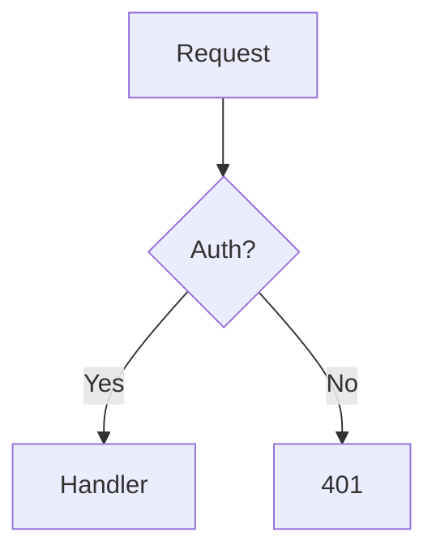

# GB Knowledge Base — Instruções para Claude Code

Documentação para trabalhar com este projeto no Claude Code.

---

## Visão geral

**GB Knowledge Base** é repositório de aprendizado pessoal + portfólio técnico focado em **.NET + AppSec**, alinhado com transição de carreira para **AppSec Engineer** (6 meses).

- **Desenvolvedor:** Gabriel Biel (@bieltrue95)
- **Email:** devgtrue@gmail.com
- **Propósito:** Knowledge base pública + referência de estudo
- **URL:** https://bieltrue95.github.io/gb-kb
- **Deploy:** Automático (push main → GitHub Pages, ~2 min)
- **Stack:** Astro v5 + Starlight + Mermaid + Markdown/MDX

---

## ⚠️ REGRA CRÍTICA — Git Commits

**NUNCA adicionar co-author Claude nos commits. Sem exceções.**

- Gabriel é o autor único — Claude é ferramenta, não contribuidor
- Commitar APENAS com `-m "mensagem"` — sem `Co-Authored-By`
- Se errar antes do push: `git commit --amend -m "mensagem correta"`
- Se já pushado: `git push origin branch --force-with-lease`
- Se chegou ao main: reescrever histórico com `git filter-branch` ou deletar repo

Ver regra completa em `.claude/rules/git-rules.md`.

---

## Comandos principais

```bash
npm install               # Instalar dependências (primeira vez)
npm run dev               # Dev server → localhost:4321/gb-kb
npm run build             # Build para produção
npm run preview           # Visualizar build local
npm run validate          # Validar frontmatter + estrutura dos artigos
npm run check-links       # Verificar links internos quebrados
npm run format            # Formatar arquivos com Prettier
npm run format:check      # Checar formatação sem alterar
npm run lint              # validate + astro check + format:check (todos)
```

---

## Estrutura de pastas

```
gb-kb/
├── .claude/
│   ├── rules/
│   │   ├── content-guidelines.md    # Padrões de conteúdo
│   │   ├── content-checklist.md     # Checklist de validação
│   │   └── git-rules.md             # Regras git para Claude
│   └── skills/
│       └── add-content/SKILL.md     # Skill para criar artigos
├── .github/workflows/
│   └── deploy.yml                   # CI/CD → GitHub Pages
├── scripts/
│   ├── validate-content.js          # Validação de frontmatter/estrutura
│   └── check-links.js               # Verificação de links
├── src/
│   ├── content/docs/
│   │   ├── about.mdx                # Página sobre o autor
│   │   ├── entrevistas.md           # Perguntas de entrevista
│   │   ├── appsec/                  # OWASP, JWT, Burp, SAST, AppSec
│   │   ├── arquitetura/             # DI, CQRS, Design Patterns
│   │   ├── aspnet/                  # REST API, Middleware, Caching
│   │   ├── async/                   # Async/Await, LINQ, Threading, Span
│   │   ├── csharp/                  # Generics, Delegates, Polymorphism
│   │   ├── data/                    # EF Core básico
│   │   ├── devops/                  # Testing, TDD
│   │   ├── distribuidos/            # Saga, Outbox, Resilience, Feature Flags
│   │   ├── dotnet/                  # SOLID, Clean Arch, Unit of Work, EF Core
│   │   ├── ferramentas/             # Docker, GitHub Actions, Azure
│   │   ├── messaging/               # RabbitMQ, Messaging Patterns
│   │   ├── redes/                   # Fundamentos de redes
│   │   └── seguranca/               # Google Cert, notas de certificação
│   └── styles/
│       ├── theme.css
│       └── reading.css
├── astro.config.mjs                 # Config Astro + sidebar
├── package.json
└── tsconfig.json
```

---

## Adicionar novo conteúdo

### Método 1: Skill (recomendado)

```bash
/add-content
# Claude pergunta categoria + título, cria arquivo com template
```

### Método 2: Manual

1. Criar `src/content/docs/{categoria}/{topico}.md` (ou `.mdx` se precisar de componentes)
2. Frontmatter obrigatório:

```yaml
---
title: Título em sentence case
description: Uma linha descrevendo o assunto (máx 160 chars)
---
```

3. Estrutura esperada:

```markdown
## Introdução

Por quê aprender? Contexto e relevância.

## Conceitos principais

Explicação clara, sem jargão desnecessário.

## Na prática

Exemplos em C#.

## Armadilhas comuns

O quê evitar.

## Referências

Links externos.
```

4. Regras de nomenclatura:
   - Arquivo: `kebab-case.md` (ex: `jwt-seguro.md`)
   - Título: sentence case (`Autenticação JWT`, não `autenticação jwt`)
   - Sempre em português brasileiro

---

## Formatos de arquivo: `.md` vs `.mdx`

- `.md` — artigos simples, sem componentes Astro
- `.mdx` — quando precisa de: diagramas Mermaid, componentes Starlight (`<Tabs>`, `<Card>`), imports
- Mermaid é integrado via `astro-mermaid` e suportado em ambos os formatos

Exemplo de diagrama Mermaid (`.mdx`):

````mdx

````

---

## Sidebar

A sidebar é gerenciada manualmente em `astro.config.mjs`. Ao adicionar um novo artigo, adicionar entrada na sidebar correspondente com label, link e badge opcional:

```js
{ label: "🔐 JWT Seguro", link: "/appsec/jwt-seguro/", badge: { text: "JWT", variant: "danger" } }
```

Categorias existentes na sidebar: Início, Padrões Distribuídos, C# Fundamentals, Async & Performance, Architecture & Design, ASP.NET Core, Data & EF Core, Testing & DevOps, Messaging & Events, Segurança & Redes.

---

## Verificação obrigatória antes de commit

```bash
npm run lint        # validate + astro check + format:check (tudo)
npm run build       # garantir que build não quebra
```

Se falhar, corrigir antes de commitar. O deploy no GitHub Actions roda apenas `npm run build` — não bloqueia por validate, mas o artigo deve passar localmente.

---

## Git workflow

```bash
# Criar branch
git checkout -b docs/topico-do-artigo

# Escrever conteúdo
# src/content/docs/{categoria}/{arquivo}.md

# Validar ANTES de commit
npm run lint
npm run build

# Commitar (SEM co-author Claude)
git add src/content/docs/ astro.config.mjs
git commit -m "docs: adicionar [topico]"

# Push
git push origin docs/topico-do-artigo
```

Convenção de mensagens de commit:
- `docs: adicionar [topico]` — novo artigo
- `docs: atualizar [topico]` — atualização de conteúdo
- `fix: corrigir [problema]` — correção de bug
- `chore: [tarefa]` — scripts, config, sem conteúdo
- `style: [mudança visual]` — CSS, tema

---

## Roadmap de conteúdo (estado atual)

### C# & .NET (Fundação)

- ✅ SOLID Principles
- ✅ Clean Architecture
- ✅ Unit of Work
- ✅ CQRS & Event Sourcing
- ✅ Design Patterns (GoF)
- ✅ Dependency Injection
- ✅ EF Core Basics
- ✅ EF Core Performance
- ✅ Polymorphism
- ✅ Interfaces vs Abstract
- ✅ Collections & Generics
- ✅ Immutability & Records
- ✅ Delegates & Events
- ✅ Async/Await & Task
- ✅ LINQ & Deferred Execution
- ✅ Threading & Locks
- ✅ Memory & Span
- ✅ REST API Design (ASP.NET)
- ✅ Middleware & Pipeline
- ✅ Caching (Redis)
- ✅ Testing & TDD

### Distribuídos & Mensageria

- ✅ Saga Pattern
- ✅ Outbox Pattern
- ✅ Resilience (Polly)
- ✅ Feature Flags
- ✅ Strangler Fig
- ✅ Deferred Execution
- ✅ Messaging Patterns
- ✅ RabbitMQ

### AppSec (Foco de carreira)

- ✅ OWASP Top 10
- ✅ Broken Access Control
- ✅ JWT Seguro
- ✅ Burp Suite
- ✅ SAST com Semgrep
- ✅ Threat Modeling
- ✅ Security Headers
- ⏳ CompTIA Security+ (notas)
- ⏳ PortSwigger Labs

### Ferramentas & DevOps

- ✅ Docker & CI/CD
- ✅ GitHub Actions
- ✅ Azure & Deploy
- ✅ Redes — Fundamentos

### Certificações

- 🔄 Google Cybersecurity Certificate (em andamento — módulos em `seguranca/google-cert/`)

---

## Plano de transição AppSec (6 meses)

| Fase | Período | Foco                          | Resultado    |
| ---- | ------- | ----------------------------- | ------------ |
| 1    | Mês 1-2 | Google Cert, TryHackMe, OWASP | KB + labs    |
| 2    | Mês 2-4 | Burp Suite, PortSwigger, SAST | Proficiency  |
| 3    | Mês 4-5 | CompTIA Security+, portfólio  | Certificação |
| 4    | Mês 6   | Aplicar para AppSec           | Transição    |

---

## Troubleshooting

### `npm run dev` não inicia

```bash
rm -rf node_modules package-lock.json
npm install
npm run dev
```

### Build falha

- Verificar frontmatter YAML (`title` + `description` obrigatórios)
- Verificar arquivo em kebab-case
- Verificar imports `.mdx` (componentes devem existir)
- Limpar cache Astro: `rm -rf .astro/data-store.json && npm run build`

### Cache Astro ao converter `.md` → `.mdx`

Ao renomear/converter arquivo, limpar obrigatoriamente:
```bash
rm -rf .astro/data-store.json
npm run build
```
Sem isso, imports podem vazar como texto literal na página.

### Deploy não funciona

- Verificar: push foi para `main`
- Aguardar: ~2 min
- Verificar: Actions no GitHub (`deploy.yml`)

---

## Links úteis

- **Site ao vivo:** https://bieltrue95.github.io/gb-kb
- **GitHub:** https://github.com/bieltrue95/gb-kb
- **Docs Astro:** https://docs.astro.build
- **Docs Starlight:** https://starlight.astro.build
- **Regras de conteúdo:** `.claude/rules/content-guidelines.md`
- **Regras git:** `.claude/rules/git-rules.md`
- **Checklist:** `.claude/rules/content-checklist.md`
