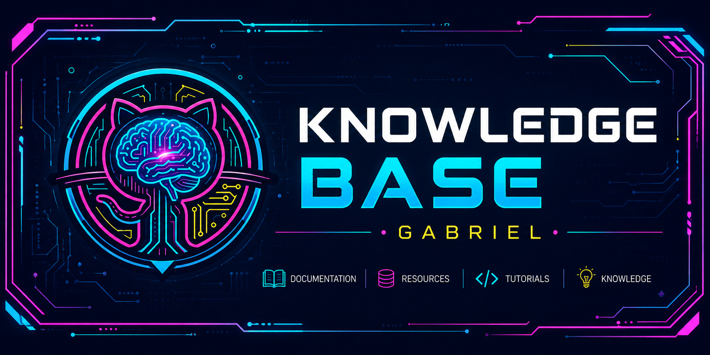

# GB Knowledge Base

[](https://bieltrue95.github.io/gb-kb)

<div align="center">

## Knowledge Base Pessoal focado em .NET + AppSec

**Aprendizado contínuo • Referência técnica • Portfólio**

🌐 [Site ao vivo](https://bieltrue95.github.io/gb-kb) • 📚 44+ artigos • 🎨 Tema Neon • 🚀 Deploy automático

</div>

---

## 📖 Sobre o Projeto

**GB Knowledge Base** é um repositório pessoal de documentação técnica alinhado com a transição de carreira para **AppSec Engineer**. Combina:

- 📚 **Knowledge Base**: Aprendizado documentado de forma estruturada
- 🎯 **Referência Técnica**: Snippets, padrões e best practices prontos para usar
- 🏆 **Portfólio**: Demonstração de expertise em .NET e segurança de aplicações
- 🚀 **Open Source**: Contribuições bem-vindas

### Visão Geral

```
GB Knowledge Base (44+ artigos)
│
├── 🧠 .NET & C# (Fundação)
│   ├── Linguagem e ecossistema
│   ├── SOLID Principles
│   ├── Design Patterns
│   ├── Entity Framework Core
│   └── ASP.NET Core
│
├── 🔒 AppSec (Foco de carreira)
│   ├── OWASP Top 10
│   ├── Burp Suite & Pentesting
│   ├── JWT & Autenticação
│   ├── Broken Access Control
│   ├── SAST (Semgrep)
│   └── Security Headers
│
├── 🛠️ Ferramentas & DevOps
│   ├── Docker & Containerização
│   ├── GitHub Actions & CI/CD
│   ├── Azure App Service
│   └── Observabilidade
│
└── 🌐 Redes & Infraestrutura
    ├── TCP/IP & Protocolos
    ├── SSL/TLS & HTTPS
    └── DNS & Segurança
```

---

## ✨ Features

| Feature                                                 | Descrição                                      |
| ------------------------------------------------------- | ---------------------------------------------- |
|  **44+ Artigos**       | Estruturados e bem documentados                |
|  **20 Diagramas**      | Mermaid em toda documentação                   |
|  **Tema Neon**         | Identidade visual futurista (Cyberpunk/AppSec) |
|  **Dark Mode**         | Otimizado para leitura noturna                 |
|  **Responsivo**        | Desktop, tablet e mobile                       |
|  **Tabs Interativas**  | Organizam conteúdo complexo                    |
|  **Performance**       | 44 pages, ~2MB                                 |
|  **Deploy Automático** | GitHub Pages + Actions (~2 min)                |
|  **Search**            | Integrado com Pagefind                         |
|  **Acessível**         | WCAG 2.1 AA                                    |

---

## 🛠️ Stack Técnico

<div align="center">


</div>

### Frontend

- **[Astro v5](https://astro.build)** - Static site generator moderno
- **[Starlight](https://starlight.astro.build)** - Documentation theme para Astro
- **Markdown + MDX** - Conteúdo com componentes React/Vue
- **Mermaid** - Diagramas ASCII vetorizados
- **CSS customizado** - Tema Neon com glow effects
- **Pagefind** - Search sem JavaScript

### DevOps

- **GitHub Pages** - Hospedagem gratuita
- **GitHub Actions** - CI/CD automático
- **Starlight Data Store** - Cache de conteúdo

### Desenvolvimento

- **Node.js + npm** - Package manager
- **Git** - Version control

---

## 🚀 Como Começar

<div align="left">


### Instalação Local

```bash
# Clonar repositório
git clone https://github.com/bieltrue95/gb-kb.git
cd gb-kb

# Instalar dependências
npm install

# Rodar servidor de desenvolvimento
npm run dev
```

Acesse em **http://localhost:4321/gb-kb** 🌟

</div>

### Comandos Disponíveis

```bash
npm run dev          # Rodar servidor local
npm run build        # Build para produção
npm run preview      # Visualizar build localmente
npm run validate     # Validar frontmatter + estrutura
npm run check-links  # Verificar links quebrados
```

---

## 📝 Como Adicionar Conteúdo

### Método 1: Automático (Skill)

```bash
/add-content
# Claude cria arquivo, frontmatter, template
```

### Método 2: Manual

1. **Criar arquivo** em `src/content/docs/{categoria}/{topico}.md`

2. **Incluir frontmatter obrigatório:**

```yaml
---
title: Título em sentence case
description: Uma linha descrevendo (máx 160 chars)
---
```

3. **Estrutura recomendada:**

```markdown
## Introdução

Por quê aprender?

## Conceitos principais

Explicação clara.

## Na prática

Exemplos em C#.

## Armadilhas comuns

O quê evitar.

## Referências

Links externos.
```

### Validação

```bash
npm run validate    # Validar frontmatter + estrutura
npm run build       # Verificar build sem erros
npm run lint        # Ambas (atalho)
```

**GitHub Actions** bloqueia merge se validação falhar ✅

---

## 📁 Estrutura de Pastas

```
gb-kb/
├── .claude/                    # Contexto reutilizável
│   ├── rules/                  # Content guidelines
│   └── skills/                 # Automação (add-content)
├── .github/workflows/
│   └── deploy.yml              # Pipeline CI/CD
├── public/
│   ├── favicon.svg             # Logo neon animado
│   └── readme-banner.svg       # Banner do README
├── src/
│   ├── content/docs/           # 📚 Todos os artigos
│   │   ├── dotnet/             # .NET & C#
│   │   ├── appsec/             # AppSec & Segurança
│   │   ├── ferramentas/        # DevOps & Tools
│   │   ├── redes/              # Network & Infra
│   │   └── ...
│   ├── styles/
│   │   └── custom.css          # 🎨 Tema Neon
│   └── layouts/
├── astro.config.mjs            # Configuração Starlight
├── package.json
└── README.md
```

---

## 🎨 Tema Neon

Identidade visual **Cyberpunk/AppSec** com cores neon vibrantes:

| Cor         | Hex       | Uso                      |
| ----------- | --------- | ------------------------ |
| **Cyan**    | `#00f0ff` | Headings, links, borders |
| **Magenta** | `#ff006e` | Destaques, accents       |
| **Verde**   | `#39ff14` | Success, code            |
| **Amarelo** | `#ffff00` | Warnings, alerts         |
| **Roxo**    | `#b700ff` | Premium effects          |
| **Dark**    | `#0a0e27` | Background (space)       |

### Efeitos

- ✨ Text glow nos headings
- 📦 Box glow nas cards/tabs
- 🔄 Animações pulsantes
- 🌟 Neon borders luminosos
- ✨ Flicker cyberpunk em H1

---

## 📊 Roadmap

### ✅ Concluído

- [x] 44+ artigos documentados
- [x] 20 diagramas Mermaid
- [x] Tema Neon completo
- [x] Ícones estratégicos
- [x] Responsive design
- [x] GitHub Pages deploy
- [x] Search integrado

### ⏳ Planejado

- [ ] Video tutorials
- [ ] Interactive labs
- [ ] Community contributions
- [ ] Multi-language support
- [ ] Offline mode (PWA)

---

## 🤝 Contribuindo

Contribuições são bem-vindas! Siga o guia em `.claude/rules/content-guidelines.md`

### Passo a passo

1. **Fork** o repositório
2. **Crie branch** `feature/seu-topico`
3. **Adicione conteúdo** em `src/content/docs/`
4. **Valide** com `npm run lint`
5. **Push** e abra **Pull Request**
6. **GitHub Actions** valida automaticamente

---

## 🔒 Segurança

- ✅ Sem dependências de desenvolvimento sensíveis
- ✅ Build estático (zero runtime code)
- ✅ GitHub Pages (HTTPS automático)
- ✅ Sem dados pessoais expostos
- ✅ Open source (audível)

---

## 📞 Contato & Links

- 👤 **Autor:** Gabriel Biel (@bieltrue95)
- 📧 **Email:** devgtrue@gmail.com
- 🌐 **Site:** https://bieltrue95.github.io/gb-kb
- 🐙 **GitHub:** https://github.com/bieltrue95/gb-kb
- 💼 **LinkedIn:** [linkedin.com/in/gabriel-biel](<[https://linkedin.com/in/gabriel-biel](https://www.linkedin.com/in/gabriel-jos%C3%A9-dos-santos/)>)

---

## 📚 Recursos

- [Astro Docs](https://docs.astro.build)
- [Starlight Docs](https://starlight.astro.build)
- [Content Guidelines](./.claude/rules/content-guidelines.md)
- [Content Checklist](./.claude/rules/content-checklist.md)

---

## 📄 Licença

Este projeto é **open source** sob licença MIT. Fique livre para usar, modificar e distribuir! 📜

---

## 🙏 Agradecimentos

- [Astro team](https://astro.build) - Excelente framework
- [Starlight team](https://starlight.astro.build) - Tema documentation incrível
- [Pagefind](https://pagefind.app) - Search sem JavaScript
- [Mermaid](https://mermaid.js.org) - Diagramas vetorizados

---

**Última atualização:** 2026-06-22  
**Status:** ✅ Em desenvolvimento ativo  
**Deploy:** 🚀 Automático via GitHub Pages
