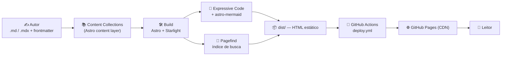
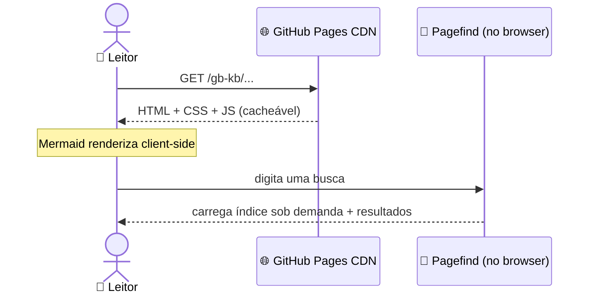
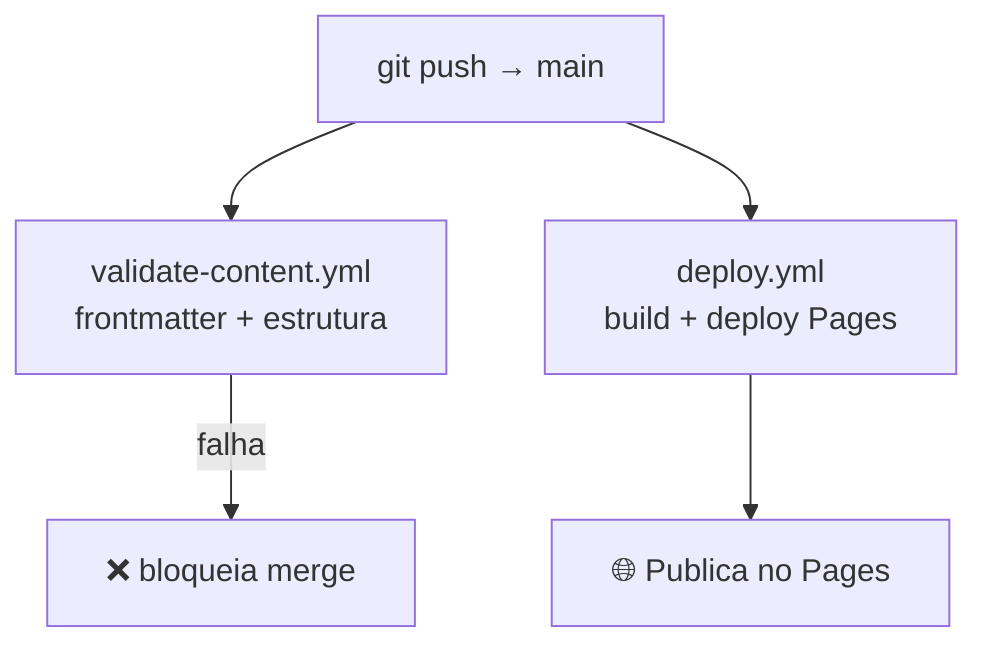
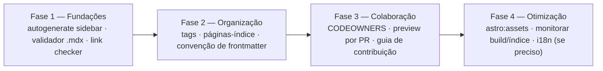

# System Design — GB Knowledge Base

> Documento **interno** de arquitetura (não publicado no site). Foco: escalar o projeto em **volume de conteúdo** mantendo-o como site estático.

## 1. Contexto e objetivo

O GB-KB é uma **base de conhecimento estática** (Astro + Starlight) publicada no GitHub Pages. Não há backend, banco de dados, autenticação nem servidores de aplicação: todo o conteúdo é gerado em tempo de build e servido como HTML/CSS/JS estático via CDN.

Este documento descreve a arquitetura atual e como ela deve evoluir conforme o conteúdo cresce de ~15 artigos para **centenas**, possivelmente com mais de um autor.

**Decisão arquitetural central:** *static-first*. Enquanto o produto for "ler conteúdo", o site permanece estático — é o modelo mais barato, mais rápido e mais seguro (superfície de ataque mínima). Só migrar para algo dinâmico se surgir necessidade real de estado por usuário (ver §8 Não-objetivos).

## 2. Arquitetura atual

### Fluxo em tempo de request (leitor)

### Fluxo de CI/CD

## 3. Componentes

| Componente | Papel | Onde |
|---|---|---|
| **Content layer** | Artigos `.md`/`.mdx` + frontmatter, organizados por categoria | `src/content/docs/{categoria}/` |
| **Starlight** | Tema de docs: navegação, sidebar, ToC, layout | `astro.config.mjs` |
| **Tema Flexoki** | Paleta/visual (plugin) | `starlight-theme-flexoki` |
| **Expressive Code** | Syntax highlighting dos blocos de código | bundled no Starlight |
| **astro-mermaid** | Diagramas Mermaid (render client-side) | `astro.config.mjs` (antes do Starlight) |
| **Pagefind** | Busca full-text estática (índice no build, busca no browser) | bundled no Starlight |
| **Validação** | Checa frontmatter e estrutura antes do merge | `scripts/validate-content.js` |
| **CI/CD** | Build + deploy + gate de validação | `.github/workflows/deploy.yml`, `validate-content.yml` |

## 4. Eixo de escala: volume de conteúdo

À medida que o número de artigos cresce, estes são os pontos que precisam evoluir:

| Dimensão | O que acontece ao crescer | Estratégia |
|---|---|---|
| **Navegação / sidebar** | Sidebar é um array mantido à mão no `astro.config.mjs`. Insustentável com dezenas/centenas de artigos. | Migrar para `autogenerate: { directory: '<categoria>' }` do Starlight — a sidebar passa a refletir a estrutura de pastas automaticamente. |
| **Taxonomia** | Categorias planas viram "gavetas" gigantes. | Subpastas por tema + convenção de frontmatter (ex: `sidebar.order`, `tags`). Definir o esquema cedo. |
| **Descoberta** | Achar conteúdo relacionado fica difícil. | Tags/coleções, páginas-índice por categoria, links internos consistentes ("Leitura recomendada"). |
| **Busca** | Índice do Pagefind cresce. | Pagefind é feito para sites grandes (índice particionado, carregado sob demanda) — escala bem; monitorar só o tamanho dos assets. |
| **Tempo de build** | Mais páginas = build mais longo no CI. | Cache do content layer do Astro; `cache: npm` no Actions (já ativo); avaliar builds incrementais. |
| **Qualidade / consistência** | Com mais autores, frontmatter e estrutura divergem. | Validação no CI como gate obrigatório + templates (skill `add-content`) + guidelines (`.claude/rules/`). |
| **Integridade de links** | Mover/renomear artigos quebra links internos. | Adicionar *link checker* no CI (ex: lychee/linkinator) sobre o `dist/`. |
| **Mídia/assets** | Imagens pesadas incham o repo e o build. | Usar `astro:assets` (otimização), nunca versionar `dist/` (já corrigido no `.gitignore`). |
| **Colaboração** | Vários autores em paralelo. | Fluxo de PR + `CODEOWNERS` + preview por PR; validação automática comenta no PR. |

## 5. Gargalos conhecidos hoje (dívida técnica)

Status após a Fase 1:

1. ✅ **Validador cobre `.mdx`.** `scripts/validate-content.js` agora percorre `.md` e `.mdx` e tolera CRLF (Windows) no parsing do frontmatter.
2. ✅ **Seções como aviso.** `REQUIRED_SECTIONS` agora gera *warning* (não erro), então `npm run validate` passa e reflete a realidade de conteúdo variado.
3. ✅ **Sidebar autogerada.** As categorias usam `autogenerate: { directory: ... }` — adicionar um artigo é só criar o arquivo na pasta. Ordem/label via frontmatter `sidebar.order` / `sidebar.label`.
4. ⚠️ **Cache do content layer ao converter `.md`→`.mdx`.** Renomear sem limpar `.astro/data-store.json` faz imports vazarem como texto. → Documentado; considerar limpar cache no CI ao detectar renomeações.
5. ✅ **Checagem de links internos no CI.** `scripts/check-links.js` valida, sobre o `dist/` buildado, que todo link `/gb-kb/...` resolve para um arquivo existente (respeita o base path). Roda no `validate-content.yml` e bloqueia merge se houver link quebrado.

## 6. Roadmap técnico (faseado)

- **Fase 1 (fundações):** corrigir a dívida técnica do §5 — sidebar autogerada, validador cobrindo `.mdx`, checagem de links no CI.
- **Fase 2 (organização):** tags/coleções, páginas-índice por categoria, esquema de frontmatter documentado.
- **Fase 3 (colaboração):** `CODEOWNERS`, deploy de preview por PR, `CONTRIBUTING.md`.
- **Fase 4 (otimização):** otimização de imagens (`astro:assets`), métricas de build, e i18n **somente se** houver demanda.

## 7. Decisões e trade-offs (ADR-lite)

| Decisão | Por quê | Trade-off aceito |
|---|---|---|
| **Site estático** | Custo zero, rápido, superfície de ataque mínima | Sem recursos dinâmicos por usuário |
| **Astro + Starlight** | Padrão de docs, ToC/busca/nav prontos | Acoplamento ao ecossistema Starlight |
| **GitHub Pages + Actions** | Grátis, integrado ao repo, deploy automático | Limites de cota do Pages; CDN do GitHub |
| **Mermaid client-side** | Build do CI leve (sem navegador headless) | Pequeno "flash" ao renderizar |
| **Pagefind** | Busca estática sem servidor | Índice no bundle do cliente |

## 8. Não-objetivos (fora de escopo enquanto for estático)

- Backend, banco de dados, API, autenticação.
- Conteúdo gerado por usuário (comentários, contas).
- Busca server-side.

> Se algum destes virar requisito, o sistema deixa de ser "site estático" e exige um **redesenho** próprio (frontend + API + banco + auth + cache) — um documento à parte.

---

*Mantido em `docs/system-design.md`. Atualizar quando a arquitetura mudar.*
