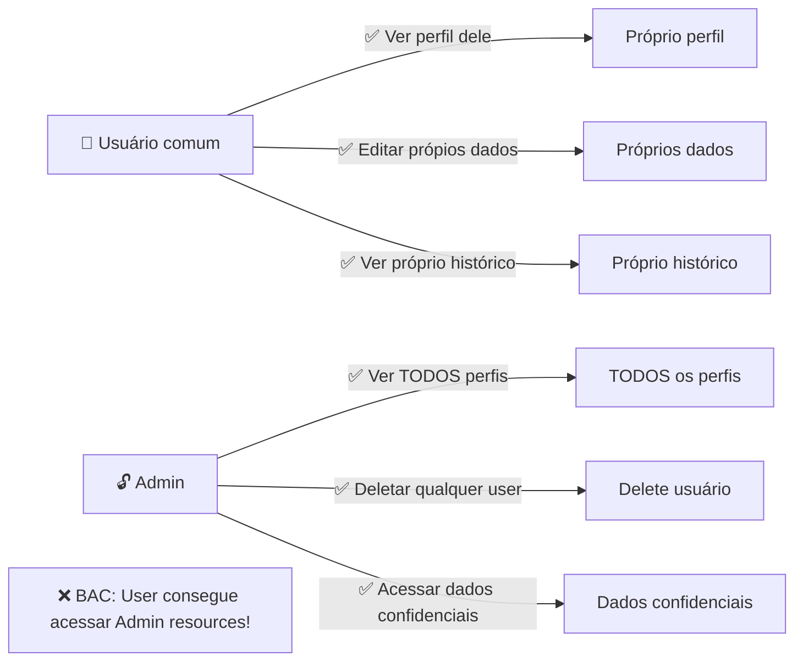
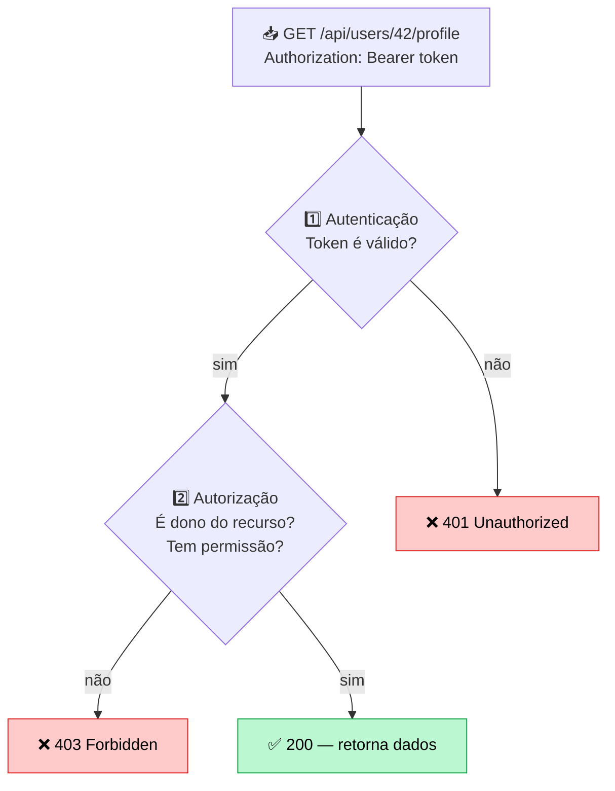

import { Tabs, TabItem } from '@astrojs/starlight/components';
import { Aside } from '@astrojs/starlight/components';

## Introdução

**Broken Access Control é a #1 vulnerabilidade do OWASP.** Significa que o sistema permite usuários fazer ações que NÃO deveriam poder fazer.



<Aside type="caution" title="Por que é crítica?">
BAC expõe dados privados, permite roubo de contas, modificação de dados sensíveis. Recrutadores procuram isso em pentests.
</Aside>

---

## O que é Access Control?



---

## 7 Tipos comuns de BAC

### 1. Insecure Direct Object Reference (IDOR)

O servidor valida autenticação, mas NÃO valida se o usuário tem direito.

<Tabs>
  <TabItem label="❌ VULNERÁVEL">
```csharp
[HttpGet("api/users/{userId}/profile")]
[Authorize] // Só valida se tá logado, não SE PODE acessar
public async Task<IActionResult> GetUserProfile(int userId)
{
    var user = await _db.Users.FindAsync(userId);
    
    // 🔓 BUG: Não verifica se o usuário pode acessar este profile!
    // Qualquer usuário logado vê qualquer perfil
    return Ok(user);
}

// Ataque:
// GET /api/users/42/profile (vejo dados de outro usuário!)
// GET /api/users/999/profile (vejo dados de QUALQUER um!)
```
  </TabItem>

  <TabItem label="✅ SEGURO">
```csharp
[HttpGet("api/users/{userId}/profile")]
[Authorize]
public async Task<IActionResult> GetUserProfile(int userId)
{
    var currentUserId = int.Parse(User.FindFirst("sub")?.Value);
    
    // ✅ VERIFICAR: User logado é o dono ou admin?
    if (userId != currentUserId && !User.IsInRole("Admin"))
        return Forbid(); // 403 Forbidden
    
    var user = await _db.Users.FindAsync(userId);
    return Ok(user);
}
```
  </TabItem>
</Tabs>

### 2. Elevation of Privilege (Privilege Escalation)

Usuário comum tira proveito da ausência de validação para virar admin.

```csharp
// ❌ VULNERÁVEL
[HttpPost("api/users")]
[Authorize]
public async Task<IActionResult> CreateUser([FromBody] CreateUserRequest request)
{
    var user = new User
    {
        Email = request.Email,
        Role = request.Role // 🔓 BUG: Aceita qualquer role que cliente envia!
    };

    await _db.Users.AddAsync(user);
    await _db.SaveChangesAsync();
    return Ok(user);
}

// Ataque (Burp Suite):
// POST /api/users
// { "email": "attacker@evil.com", "role": "Admin" }
// ➡️ Criou admin automaticamente!

// ✅ SEGURO
[HttpPost("api/users")]
[Authorize(Roles = "Admin")] // Só admin cria usuários
public async Task<IActionResult> CreateUser([FromBody] CreateUserRequest request)
{
    var user = new User
    {
        Email = request.Email,
        Role = "User" // ✅ Sempre "User", cliente NÃO controla
    };

    await _db.Users.AddAsync(user);
    await _db.SaveChangesAsync();
    return Ok(user);
}
```

### 3. Manipulation de URLs/Parâmetros

Mudar URL para acessar recursos que não deveria.

```csharp
// ❌ VULNERÁVEL
[HttpGet("api/orders/{orderId}/invoice")]
[Authorize]
public async Task<IActionResult> GetInvoice(int orderId)
{
    // 🔓 Não valida se o usuário é dono do pedido
    var invoice = await _db.Invoices.FirstOrDefaultAsync(i => i.OrderId == orderId);
    return Ok(invoice);
}

// Ataque:
// User 1 faz: GET /api/orders/1/invoice ✅ OK (dele)
// User 1 tenta: GET /api/orders/999/invoice ❌ Vê invoice de outro!

// ✅ SEGURO
[HttpGet("api/orders/{orderId}/invoice")]
[Authorize]
public async Task<IActionResult> GetInvoice(int orderId)
{
    var currentUserId = User.FindFirst("sub").Value;
    
    // Verificar propriedade
    var order = await _db.Orders.FindAsync(orderId);
    if (order.UserId.ToString() != currentUserId)
        return Forbid();
    
    var invoice = await _db.Invoices
        .FirstOrDefaultAsync(i => i.OrderId == orderId);
    return Ok(invoice);
}
```

### 4. Missing Access Control em Funções Sensíveis

Delete, Admin operations sem verificação.

```csharp
// ❌ VULNERÁVEL
[HttpDelete("api/users/{userId}")]
[Authorize] // Só valida autenticação
public async Task<IActionResult> DeleteUser(int userId)
{
    // 🔓 Qualquer usuário logado deleta qualquer usuário!
    var user = await _db.Users.FindAsync(userId);
    _db.Users.Remove(user);
    await _db.SaveChangesAsync();
    return Ok();
}

// ✅ SEGURO
[HttpDelete("api/users/{userId}")]
[Authorize(Roles = "Admin")] // Só admin pode deletar
public async Task<IActionResult> DeleteUser(int userId)
{
    var user = await _db.Users.FindAsync(userId);
    _db.Users.Remove(user);
    await _db.SaveChangesAsync();
    return Ok();
}
```

### 5. Token Fraco/Reutilizável

Token que nunca expira ou é fácil de forjar.

```csharp
// ❌ VULNERÁVEL
var token = new JwtSecurityToken(
    issuer: "app",
    audience: "users",
    claims: new[] { new Claim("sub", userId.ToString()) },
    // 🔓 Token nunca expira!
    expires: null,
    signingCredentials: new SigningCredentials(
        new SymmetricSecurityKey(Encoding.UTF8.GetBytes("secret123")),
        SecurityAlgorithms.HmacSha256
    )
);

// ✅ SEGURO
var token = new JwtSecurityToken(
    issuer: "app",
    audience: "users",
    claims: new[] { new Claim("sub", userId.ToString()) },
    expires: DateTime.UtcNow.AddHours(1), // ✅ Expira em 1h
    signingCredentials: new SigningCredentials(
        new SymmetricSecurityKey(Encoding.UTF8.GetBytes(secretKey)),
        SecurityAlgorithms.HmacSha256Signature
    )
);
```

### 6. CORS Mal Configurado

Permite origem errada acessar dados sensíveis.

```csharp
// ❌ VULNERÁVEL
services.AddCors(options =>
{
    options.AddDefaultPolicy(builder =>
    {
        builder.AllowAnyOrigin() // 🔓 Qualquer site!
               .AllowAnyMethod()
               .AllowAnyHeader()
               .AllowCredentials(); // ❌ Com credenciais!
    });
});

// Ataque:
// evil.com faz fetch para https://seu-api.com/api/users
// Navegador permite! CORS quebrado.

// ✅ SEGURO
services.AddCors(options =>
{
    options.AddPolicy("AllowUI", builder =>
    {
        builder.WithOrigins("https://seu-app.com") // ✅ Só seu app
               .WithMethods("GET", "POST")
               .WithHeaders("Authorization", "Content-Type")
               .AllowCredentials();
    });
});
```

### 7. Path Traversal / Directory Traversal

Acessar arquivos que não deveria via caminho manipulado.

```csharp
// ❌ VULNERÁVEL
[HttpGet("api/files/{filename}")]
[Authorize]
public IActionResult DownloadFile(string filename)
{
    // 🔓 Não valida path, permite ../ para sair do diretório
    var path = Path.Combine("/uploads", filename);
    return PhysicalFile(path, "application/octet-stream");
}

// Ataque:
// GET /api/files/../../etc/passwd
// ➡️ Acessa /etc/passwd (Linux)!
// GET /api/files/../../web.config
// ➡️ Acessa web.config (expõe connection strings!)

// ✅ SEGURO
[HttpGet("api/files/{fileId}")]
[Authorize]
public async Task<IActionResult> DownloadFile(int fileId)
{
    // Não usar filenames diretos
    var file = await _db.Files.FindAsync(fileId);
    if (file == null)
        return NotFound();
    
    // Verificar propriedade
    var currentUserId = User.FindFirst("sub").Value;
    if (file.UploadedBy.ToString() != currentUserId)
        return Forbid();
    
    var path = file.ServerPath;
    // Garantir que path está dentro de /uploads
    if (!Path.GetFullPath(path).StartsWith("/uploads"))
        return BadRequest("Invalid file");
    
    return PhysicalFile(path, "application/octet-stream");
}
```

---

## Como Explorar com Burp Suite

### Passo 1: Capturar request autenticado
```
1. Abra Burp Suite
2. Acesse sua app logado
3. Faça uma ação (GET /api/users/123/profile)
4. Burp intercepta automaticamente
```

### Passo 2: Modificar parâmetros
```
GET /api/users/123/profile
Authorization: Bearer seu_token

❌ Mude para:
GET /api/users/999/profile  (outro usuário)
GET /api/users/admin/profile (path diferente)
```

### Passo 3: Enviar (Send to Repeater)
```
Burp Repeater:
1. Clique em modificação
2. Send
3. Ver response (sucesso = vulnerável!)
```

---

## Checklist de Segurança

- [ ] ✅ Toda ação sensível requer autenticação
- [ ] ✅ Verificar se usuário é DONO ou tem PERMISSÃO
- [ ] ✅ Não confiar em IDs de cliente (e.g., userId)
- [ ] ✅ Usar JWT/Bearer tokens com expiração
- [ ] ✅ Implementar rate limiting (prevenir força bruta)
- [ ] ✅ Logar tentativas de acesso negado
- [ ] ✅ CORS configurado restritivamente
- [ ] ✅ Roles/Permissions centralizados

---

## Na prática: Middleware de Autorização

Criar middleware reutilizável em ASP.NET Core:

```csharp
// Middleware customizado
public class AuthorizationMiddleware
{
    private readonly RequestDelegate _next;

    public AuthorizationMiddleware(RequestDelegate next)
    {
        _next = next;
    }

    public async Task InvokeAsync(HttpContext context)
    {
        var token = context.Request.Headers["Authorization"]
            .ToString()
            .Replace("Bearer ", "");

        if (string.IsNullOrEmpty(token))
        {
            context.Response.StatusCode = 401;
            await context.Response.WriteAsJsonAsync(
                new { error = "Token ausente" }
            );
            return;
        }

        try
        {
            var principal = ValidateToken(token);
            context.User = principal;
        }
        catch
        {
            context.Response.StatusCode = 401;
            await context.Response.WriteAsJsonAsync(
                new { error = "Token inválido" }
            );
            return;
        }

        await _next(context);
    }

    private ClaimsPrincipal ValidateToken(string token)
    {
        var handler = new JwtSecurityTokenHandler();
        var key = Encoding.ASCII.GetBytes(Environment.GetEnvironmentVariable("JWT_KEY"));
        
        return handler.ValidateToken(token, new TokenValidationParameters
        {
            ValidateIssuerSigningKey = true,
            IssuerSigningKey = new SymmetricSecurityKey(key),
            ValidateIssuer = true,
            ValidIssuer = "seu-app",
            ValidateAudience = true,
            ValidAudience = "api-users",
            ValidateLifetime = true
        }, out _);
    }
}

// Program.cs
app.UseMiddleware<AuthorizationMiddleware>();
```

---

## Referências

- [OWASP A01:2021 — Broken Access Control](https://owasp.org/Top10/A01_2021-Broken_Access_Control/)
- [OWASP Authorization Cheat Sheet](https://cheatsheetseries.owasp.org/cheatsheets/Authorization_Cheat_Sheet.html)
- [PortSwigger — Access Control](https://portswigger.net/web-security/access-control)
- [CWE-639 — Authorization Bypass](https://cwe.mitre.org/data/definitions/639.html)
