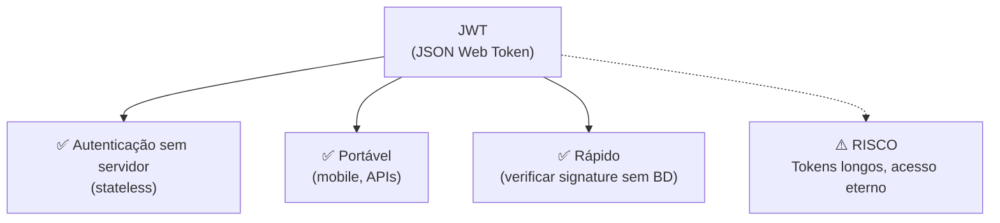
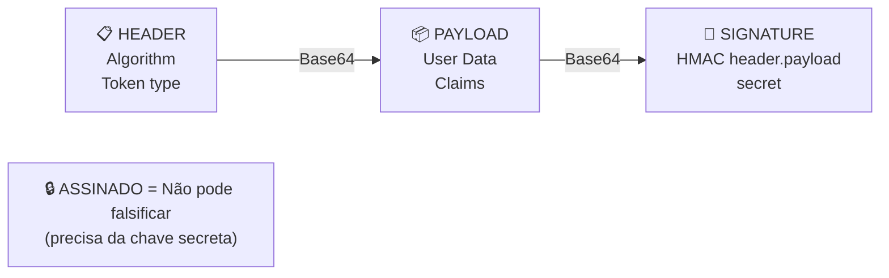
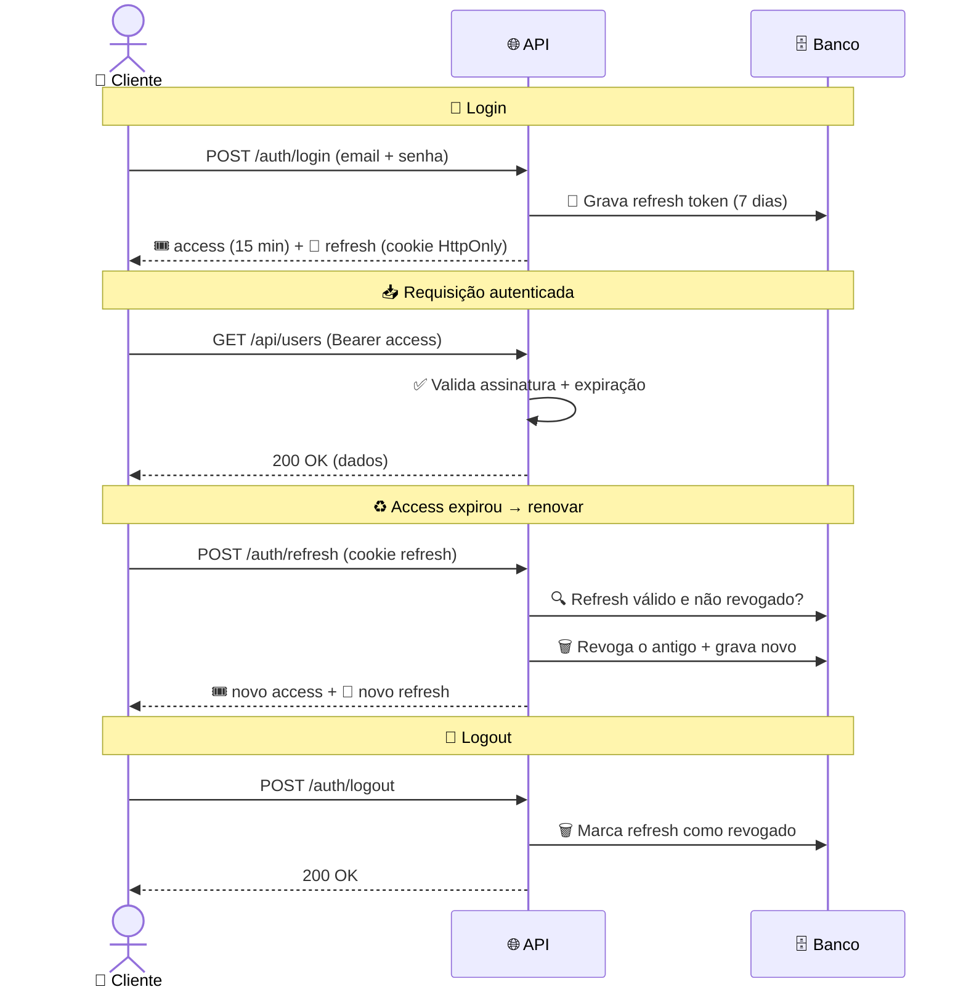

import { Tabs, TabItem } from "@astrojs/starlight/components";
import { Aside } from "@astrojs/starlight/components";

## Introdução

**JWT é padrão-ouro para autenticação stateless**, mas pode ser perigoso se implementado errado.



<Aside type="tip" title="Quando usar JWT?">
  ✅ APIs (mobile, SPA, third-party) ✅ Microserviços ❌ Apps monolíticas (cookies são mais simples)
</Aside>

---

## Estrutura JWT

```
eyJhbGciOiJIUzI1NiIsInR5cCI6IkpXVCJ9.
eyJzdWIiOiI1IiwiZW1haWwiOiJ1c2VyQGFwcC5jb20iLCJleHAiOjE2ODM2MzM2MDB9.
abc123def456...
```



---

## O Problema: Tokens Longos

<Tabs>
  <TabItem label="❌ Token longo (8h)">
```csharp
var token = new JwtSecurityToken(
    issuer: "app",
    audience: "api",
    claims: new[]
    {
        new Claim("sub", userId.ToString()),
        new Claim("email", user.Email),
        new Claim("role", "Admin"),
        new Claim("org", "Acme Inc"),
        new Claim("feature_x", "true"),
        // ... mais claims
    },
    expires: DateTime.UtcNow.AddHours(8), // 🔓 8 HORAS!
    signingCredentials: credentials
);

// PROBLEMA:
// ├─ Se token é roubado, atacante tem 8h de acesso
// ├─ Se permissões mudam, usuário continua com permissão antiga
// └─ Token pode ficar muito grande (payload gigante)

````
  </TabItem>

  <TabItem label="✅ Refresh Token Pattern">
```csharp
// Access Token: CURTO (15 minutos)
var accessToken = new JwtSecurityToken(
    issuer: "app",
    audience: "api",
    claims: new[] { new Claim("sub", userId.ToString()) },
    expires: DateTime.UtcNow.AddMinutes(15), // ✅ 15 minutos
    signingCredentials: credentials
);

// Refresh Token: LONGO (7 dias, BD)
var refreshToken = new RefreshToken
{
    Token = Guid.NewGuid().ToString(),
    UserId = userId,
    ExpiresAt = DateTime.UtcNow.AddDays(7), // Pode expirar
    RevokedAt = null // Pode ser revogado (logout)
};
await _db.RefreshTokens.AddAsync(refreshToken);
await _db.SaveChangesAsync();

return new LoginResponse
{
    AccessToken = new JwtSecurityTokenHandler().WriteToken(accessToken),
    RefreshToken = refreshToken.Token,
    ExpiresIn = 900 // segundos
};
````

  </TabItem>
</Tabs>

---

## Flow Seguro: Access + Refresh Token



---

## Implementação Completa em ASP.NET Core

### 1. Models

```csharp
public class RefreshToken
{
    public int Id { get; set; }
    public int UserId { get; set; }
    public string Token { get; set; }
    public DateTime ExpiresAt { get; set; }
    public DateTime? RevokedAt { get; set; } // null = ativo
    public User User { get; set; }

    public bool IsValid => RevokedAt == null && DateTime.UtcNow < ExpiresAt;
}
```

### 2. Serviço de Auth

<Tabs>
  <TabItem label="Gerar Tokens">
```csharp
public class AuthService
{
    private readonly IConfiguration _config;
    private readonly MyDbContext _db;

    public async Task<LoginResponse> LoginAsync(string email, string password)
    {
        var user = await _db.Users
            .FirstOrDefaultAsync(u => u.Email == email);

        if (user == null || !BCrypt.Net.BCrypt.Verify(password, user.PasswordHash))
            throw new UnauthorizedAccessException("Email ou senha inválido");

        var accessToken = GenerateAccessToken(user);
        var refreshToken = await GenerateRefreshTokenAsync(user.Id);

        return new LoginResponse
        {
            AccessToken = accessToken,
            RefreshToken = refreshToken.Token,
            ExpiresIn = 900 // 15 minutos em segundos
        };
    }

    private string GenerateAccessToken(User user)
    {
        var key = Encoding.ASCII.GetBytes(
            Environment.GetEnvironmentVariable("JWT_SECRET_KEY")
        );

        var claims = new[]
        {
            new Claim("sub", user.Id.ToString()),
            new Claim("email", user.Email),
            new Claim(ClaimTypes.Role, user.Role)
        };

        var token = new JwtSecurityToken(
            issuer: "seu-app",
            audience: "api-users",
            claims: claims,
            expires: DateTime.UtcNow.AddMinutes(15), // ✅ Curto!
            signingCredentials: new SigningCredentials(
                new SymmetricSecurityKey(key),
                SecurityAlgorithms.HmacSha256Signature
            )
        );

        return new JwtSecurityTokenHandler().WriteToken(token);
    }

    private async Task<RefreshToken> GenerateRefreshTokenAsync(int userId)
    {
        var refreshToken = new RefreshToken
        {
            UserId = userId,
            Token = Convert.ToBase64String(
                System.Security.Cryptography.RandomNumberGenerator.GetBytes(64)
            ),
            ExpiresAt = DateTime.UtcNow.AddDays(7)
        };

        await _db.RefreshTokens.AddAsync(refreshToken);
        await _db.SaveChangesAsync();

        return refreshToken;
    }

}

````
  </TabItem>

  <TabItem label="Renovar Tokens">
```csharp
public async Task<LoginResponse> RefreshAsync(string refreshTokenValue)
{
    var refreshToken = await _db.RefreshTokens
        .Include(rt => rt.User)
        .FirstOrDefaultAsync(rt => rt.Token == refreshTokenValue);

    if (refreshToken == null || !refreshToken.IsValid)
        throw new UnauthorizedAccessException("Refresh token inválido ou expirado");

    // Revogar token antigo (use uma vez)
    refreshToken.RevokedAt = DateTime.UtcNow;
    _db.RefreshTokens.Update(refreshToken);

    // Gerar novos tokens
    var newAccessToken = GenerateAccessToken(refreshToken.User);
    var newRefreshToken = await GenerateRefreshTokenAsync(refreshToken.User.Id);

    await _db.SaveChangesAsync();

    return new LoginResponse
    {
        AccessToken = newAccessToken,
        RefreshToken = newRefreshToken.Token,
        ExpiresIn = 900
    };
}
````

  </TabItem>
</Tabs>

### 3. Controller

```csharp
[ApiController]
[Route("api/[controller]")]
public class AuthController : ControllerBase
{
    private readonly AuthService _authService;

    [HttpPost("login")]
    public async Task<IActionResult> Login([FromBody] LoginRequest request)
    {
        var response = await _authService.LoginAsync(request.Email, request.Password);

        // 🔒 HttpOnly = JavaScript não consegue acessar (XSS protection)
        Response.Cookies.Append(
            "refreshToken",
            response.RefreshToken,
            new CookieOptions
            {
                HttpOnly = true,
                Secure = true, // HTTPS only
                SameSite = SameSiteMode.Strict,
                Expires = DateTimeOffset.UtcNow.AddDays(7)
            }
        );

        return Ok(new
        {
            accessToken = response.AccessToken,
            expiresIn = response.ExpiresIn
        });
    }

    [HttpPost("refresh")]
    public async Task<IActionResult> Refresh()
    {
        var refreshToken = Request.Cookies["refreshToken"];

        if (string.IsNullOrEmpty(refreshToken))
            return Unauthorized();

        var response = await _authService.RefreshAsync(refreshToken);

        Response.Cookies.Append(
            "refreshToken",
            response.RefreshToken,
            new CookieOptions
            {
                HttpOnly = true,
                Secure = true,
                SameSite = SameSiteMode.Strict,
                Expires = DateTimeOffset.UtcNow.AddDays(7)
            }
        );

        return Ok(new
        {
            accessToken = response.AccessToken,
            expiresIn = response.ExpiresIn
        });
    }

    [HttpPost("logout")]
    [Authorize]
    public async Task<IActionResult> Logout()
    {
        var refreshToken = Request.Cookies["refreshToken"];

        if (!string.IsNullOrEmpty(refreshToken))
        {
            // Revogar refresh token
            var token = await _db.RefreshTokens
                .FirstOrDefaultAsync(rt => rt.Token == refreshToken);

            if (token != null)
            {
                token.RevokedAt = DateTime.UtcNow;
                _db.RefreshTokens.Update(token);
                await _db.SaveChangesAsync();
            }
        }

        Response.Cookies.Delete("refreshToken");
        return Ok();
    }
}
```

### 4. Configuração no Program.cs

```csharp
// Add services
services.AddScoped<AuthService>();

services.AddAuthentication(JwtBearerDefaults.AuthenticationScheme)
    .AddJwtBearer(options =>
    {
        var key = Encoding.ASCII.GetBytes(
            Environment.GetEnvironmentVariable("JWT_SECRET_KEY")
        );

        options.TokenValidationParameters = new TokenValidationParameters
        {
            ValidateIssuerSigningKey = true,
            IssuerSigningKey = new SymmetricSecurityKey(key),
            ValidateIssuer = true,
            ValidIssuer = "seu-app",
            ValidateAudience = true,
            ValidAudience = "api-users",
            ValidateLifetime = true,
            ClockSkew = TimeSpan.Zero // Sem margem
        };
    });

services.AddAuthorization();

// Use middleware
app.UseAuthentication();
app.UseAuthorization();
```

---

## Proteção contra Ataques Comuns

### Token Hijacking

```csharp
// ❌ VULNERÁVEL
// Token armazenado em localStorage
localStorage.setItem('token', accessToken); // XSS rouba tudo

// ✅ SEGURO
// Token em memória (perdido ao refresh), refresh em HttpOnly cookie
sessionStorage.setItem('accessToken', accessToken);
// refreshToken está em cookie HttpOnly (JS não acessa)
```

### Token Reuse

```csharp
// ✅ Refresh tokens SÃO DE USO ÚNICO
// Cada refresh marca como "revoked" e gera novo

public async Task<LoginResponse> RefreshAsync(string token)
{
    var refreshToken = await _db.RefreshTokens
        .FirstOrDefaultAsync(rt => rt.Token == token);

    if (refreshToken.RevokedAt != null)
        throw new UnauthorizedAccessException("Token já foi usado (possível ataque)");

    // Revogar (use-once)
    refreshToken.RevokedAt = DateTime.UtcNow;

    // Gerar novo
    var newToken = GenerateRefreshToken(...);

    await _db.SaveChangesAsync();
    return newToken;
}
```

### Expiração de Claims

```csharp
// ❌ RUIM: Claims fora de data
var user = GetUserFromToken(); // Token tem 15 min
if (user.IsAdmin) // ✅ Funciona
    DeleteUser();

// (depois de 10 minutos)
if (user.IsAdmin) // ❌ Ainda pensa que é admin!
    DeleteUser(); // Mas token é válido por mais 5 min

// ✅ BOM: Sempre validar token
[Authorize(Roles = "Admin")]
public IActionResult DeleteUser(int id) { ... }
// ASP.NET valida token ANTES de entrar
```

---

## Checklist de Segurança JWT

- [ ] ✅ Access Token com expiração CURTA (15 minutos)
- [ ] ✅ Refresh Token em cookie HttpOnly (+ BD)
- [ ] ✅ Refresh Token é uso-único
- [ ] ✅ Logout revoga refresh token
- [ ] ✅ JWT_SECRET_KEY em environment variable
- [ ] ✅ Validar issuer e audience
- [ ] ✅ Validar lifetime (não desabilitar!)
- [ ] ✅ HTTPS em produção (não aceitar HTTP)
- [ ] ✅ CORS configurado restritivamente

---

## Na prática: Testar com Burp Suite

```
1. Login com Burp interceptando
   POST /api/auth/login
   { "email": "user@app.com", "password": "123456" }

2. Response:
   {
     "accessToken": "eyJhbGc...",
     "expiresIn": 900
   }
   Set-Cookie: refreshToken=xxx; HttpOnly; Secure

3. Usar token em request seguinte
   GET /api/users
   Authorization: Bearer eyJhbGc...

4. Simular expiração
   Aguarde 15 minutos (ou forge token com expires antigo)
   GET /api/users → 401 Unauthorized

5. Refresh
   POST /api/auth/refresh
   Cookie: refreshToken=xxx
   → Novo access token
```

---

## Referências

- [RFC 7519 — JSON Web Token (JWT)](https://tools.ietf.org/html/rfc7519)
- [OWASP JWT Cheat Sheet](https://cheatsheetseries.owasp.org/cheatsheets/JSON_Web_Token_for_Java_Cheat_Sheet.html)
- [ASP.NET Core Authentication & Authorization](https://learn.microsoft.com/en-us/aspnet/core/security/authentication)
- [Refresh Token Rotation Best Practices](https://auth0.com/blog/refresh-tokens-what-are-they-and-when-to-use-them/)
