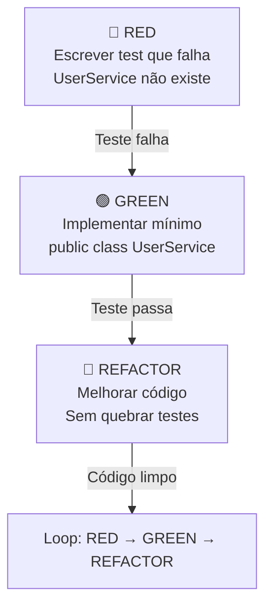

import { Tabs, TabItem } from "@astrojs/starlight/components";

## Introdução

**TDD** = Test-Driven Development (Red → Green → Refactor).

**Pirâmide de testes**:

- 🔴 **Unit** (70%) — isolado, rápido
- 🟡 **Integration** (20%) — com dependências reais
- 🟢 **E2E** (10%) — workflow completo

---

<Tabs>
  <TabItem label="🔄 TDD Workflow">

## Red-Green-Refactor



## AAA Pattern (Arrange-Act-Assert)

**Arrange** → Setup dados e mocks  
**Act** → Executar código  
**Assert** → Validar resultado

</TabItem>

  <TabItem label="🧬 Unit Tests">

## Testes isolados com Mocks

```csharp
public class UserServiceTests
{
    [Fact]
    public async Task CreateUser_ValidInput_ReturnUserWithId()
    {
        // 1. Arrange: preparar dados e mocks
        var mockRepository = new Mock<IUserRepository>();
        mockRepository
            .Setup(r => r.AddAsync(It.IsAny<User>()))
            .ReturnsAsync((User u) => { u.Id = 1; return u; });

        var mockEmailService = new Mock<IEmailService>();
        var service = new UserService(mockRepository.Object, mockEmailService.Object);

        var dto = new CreateUserDto { Name = "Alice", Email = "alice@example.com" };

        // 2. Act: executar
        var result = await service.CreateUserAsync(dto);

        // 3. Assert: validar resultado
        Assert.NotNull(result);
        Assert.Equal(1, result.Id);
        Assert.Equal("Alice", result.Name);

        // Verificar que serviços foram chamados corretamente
        mockRepository.Verify(
            r => r.AddAsync(It.Is<User>(u => u.Name == "Alice")),
            Times.Once);
        mockEmailService.Verify(
            e => e.SendWelcomeAsync("alice@example.com"),
            Times.Once);
    }
}
```

## Naming Convention (crucial!)

```csharp
// ✅ Bom: MethodName_Scenario_ExpectedResult
[Fact]
public async Task CreateUser_WithValidInput_ReturnsUserWithId()
{
}

// ❌ Ruim: Test1, TestCreateUser
[Fact]
public async Task Test1()
{
}
```

</TabItem>

  <TabItem label="📦 Fixtures">

## Reutilizar setup

```csharp
public class UserServiceFixture : IAsyncLifetime
{
    public Mock<IUserRepository> MockRepository { get; }
    public Mock<IEmailService> MockEmailService { get; }
    public UserService Service { get; }

    public UserServiceFixture()
    {
        MockRepository = new Mock<IUserRepository>();
        MockEmailService = new Mock<IEmailService>();
        Service = new UserService(MockRepository.Object, MockEmailService.Object);
    }

    public Task InitializeAsync() => Task.CompletedTask;
    public Task DisposeAsync() => Task.CompletedTask;
}

public class UserServiceTests : IClassFixture<UserServiceFixture>
{
    private readonly UserServiceFixture _fixture;

    public UserServiceTests(UserServiceFixture fixture) => _fixture = fixture;

    [Fact]
    public async Task CreateUser_ShouldCallRepository()
    {
        await _fixture.Service.CreateUserAsync(new CreateUserDto { Name = "Alice" });
        _fixture.MockRepository.Verify(r => r.AddAsync(It.IsAny<User>()), Times.Once);
    }
}
```

</TabItem>

  <TabItem label="🔗 Integration Tests">

## Com dependências reais (WebApplicationFactory)

```csharp
public class UserApiTests : IAsyncLifetime
{
    private WebApplicationFactory<Program> _factory;
    private HttpClient _client;
    private AppDbContext _dbContext;

    public async Task InitializeAsync()
    {
        // Customizar factory pra usar in-memory DB
        _factory = new WebApplicationFactory<Program>()
            .WithWebHostBuilder(builder =>
            {
                builder.ConfigureServices(services =>
                {
                    // Remove real DB
                    var descriptor = services.SingleOrDefault(
                        d => d.ServiceType == typeof(DbContextOptions<AppDbContext>));
                    if (descriptor != null)
                        services.Remove(descriptor);

                    // Usa in-memory
                    services.AddDbContext<AppDbContext>(options =>
                        options.UseInMemoryDatabase("TestDb"));
                });
            });

        _client = _factory.CreateClient();
        _dbContext = _factory.Services.GetRequiredService<AppDbContext>();
        await _dbContext.Database.EnsureCreatedAsync();
    }

    [Fact]
    public async Task CreateUser_ValidInput_ReturnsCreated()
    {
        // Arrange
        var dto = new CreateUserDto { Name = "Alice", Email = "alice@ex.com" };
        var content = new StringContent(
            JsonSerializer.Serialize(dto),
            Encoding.UTF8,
            "application/json");

        // Act
        var response = await _client.PostAsync("/api/users", content);

        // Assert
        Assert.Equal(HttpStatusCode.Created, response.StatusCode);
        var result = JsonSerializer.Deserialize<UserDto>(
            await response.Content.ReadAsStringAsync());
        Assert.NotNull(result.Id);
    }

    [Fact]
    public async Task GetUser_AfterCreate_ReturnsSameUser()
    {
        // Arrange: criar user diretamente no DB
        var user = new User { Name = "Bob", Email = "bob@ex.com" };
        _dbContext.Users.Add(user);
        await _dbContext.SaveChangesAsync();

        // Act
        var response = await _client.GetAsync($"/api/users/{user.Id}");

        // Assert
        Assert.Equal(HttpStatusCode.OK, response.StatusCode);
    }

    public async Task DisposeAsync()
    {
        await _dbContext.DisposeAsync();
        _factory.Dispose();
    }
}
```

</TabItem>

  <TabItem label="📊 Coverage">

## Cobertura de testes

```bash
# Instalar Coverlet (coleta cobertura)
dotnet add package coverlet.collector

# Rodar testes com coverage
dotnet test /p:CollectCoverage=true /p:CoverageFormat=lcov

# Coverage mínimo: 80%
dotnet test /p:CollectCoverage=true /p:Threshold=80
```

## Performance Testing

```csharp
[Fact]
public void CreateUser_ShouldBeUnderXMs()
{
    var stopwatch = Stopwatch.StartNew();

    // Act
    var result = service.CreateUser(new User { Name = "Test" });

    stopwatch.Stop();

    // Assert: menos de 100ms
    Assert.True(stopwatch.ElapsedMilliseconds < 100,
        $"Levou {stopwatch.ElapsedMilliseconds}ms");
}
```

</TabItem>

  <TabItem label="🔒 Security">

## Testes de segurança

```csharp
[Fact]
public async Task CreateUser_WithInjection_ShouldSanitize()
{
    var dto = new CreateUserDto
    {
        Name = "<script>alert('xss')</script>"
    };

    var result = await _service.CreateUserAsync(dto);

    // Verificar que script não foi salvo literal
    Assert.DoesNotContain("<script>", result.Name);
}

[Fact]
public async Task UpdateUser_Unauthorized_ShouldReturn401()
{
    var response = await _client.PutAsync("/api/users/1", content);
    Assert.Equal(HttpStatusCode.Unauthorized, response.StatusCode);
}
```

</TabItem>
</Tabs>

---

## ⚠️ Armadilhas comuns

❌ **Testar a UI com unit tests** → Deve ser integration test

❌ **Testes muito acoplados ao código** → Quebram com refactor

❌ **Mocks em tudo** → Perde integração real

❌ **Testes lentos** → Não rodam frequente

❌ **Sem cobertura** → Regressões passam despercebidas

❌ **Fixtures compartilhadas entre testes** → Estado compartilhado causa falhas

## 📚 Referências

- [xUnit Docs](https://xunit.net/)
- [Moq GitHub](https://github.com/Moq/moq4)
- [WebApplicationFactory](https://docs.microsoft.com/en-us/aspnet/core/test/integration-tests)
- [TDD Best Practices](https://learn.microsoft.com/en-us/archive/msdn-magazine/2015/june/testing-unit-testing-best-practices)
- [Test Naming Conventions](https://github.com/google/styleguide/blob/gh-pages/csharp/csharp-style-guide.md)
