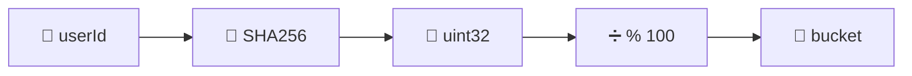

## Introdução

**Feature flags** (ou feature toggles) permitem controlar o rollout de novas funcionalidades em produção **sem deploy**. Você pode ativar para 10% dos usuários, depois 50%, depois 100% — tudo em runtime.

**Diferente de configuração:** Flags são _dinâmicas_ (mudam sem restart), _granulares_ (por usuário/empresa/região) e _rastreáveis_ (auditoria).

## Conceitos principais

### Hash determinístico

A chave: **mesmo usuário sempre cai no mesmo bucket**, sem armazenar estado:



Se rolloutPercent = 30, usuários 0-29 têm a flag ativada. **Sempre**. Sem variance.

### Vantagens

- ✅ Sem banco de dados (stateless)
- ✅ Canary deploys (1% → 10% → 100%)
- ✅ Kill switch (desativa em segundos)
- ✅ A/B testing (usuários consistentes)
- ✅ Gradual rollback (0% volta a ativar o antigo)

### Tipos de flags

| Tipo           | Lifetime      | Caso de uso                  |
| -------------- | ------------- | ---------------------------- |
| **Release**    | Semanas/meses | Controlar nova feature       |
| **Experiment** | Dias          | A/B testing                  |
| **Ops**        | Horas         | Kill switch, circuit breaker |
| **Permission** | Variável      | Acesso a beta, early access  |

## Na prática

### Implementação básica

```csharp
public class FeatureFlagService
{
    public bool IsEnabled(string flagName, string userId, int rolloutPercent)
    {
        if (rolloutPercent >= 100) return true;
        if (rolloutPercent <= 0) return false;

        // Hash determinístico
        var hash = SHA256.HashData(Encoding.UTF8.GetBytes(userId));
        var bucket = BitConverter.ToUInt32(hash, 0) % 100;

        return bucket < rolloutPercent;
    }
}

// Uso
var isNewUI = _flags.IsEnabled("new-dashboard", userId, 30);
if (isNewUI)
    return DashboardV2(data);
else
    return DashboardV1(data);
```

### Com cache + metrics

```csharp
public class FeatureFlagService
{
    private readonly IMemoryCache _cache;
    private readonly IMetrics _metrics;

    public bool IsEnabled(string flagName, string userId)
    {
        // Cache a decisão por 5 min
        var cacheKey = $"flag:{flagName}:{userId}";
        if (_cache.TryGetValue(cacheKey, out bool enabled))
            return enabled;

        // Busca config do Redis/banco
        var config = await _repository.GetFlag(flagName);
        var result = Evaluate(config, userId);

        _cache.Set(cacheKey, result, TimeSpan.FromMinutes(5));
        _metrics.Counter("flags.evaluated", 1, new[] { $"flag:{flagName}", $"result:{result}" });

        return result;
    }

    private bool Evaluate(FlagConfig config, string userId)
    {
        if (!config.IsEnabled) return false;

        var hash = SHA256.HashData(Encoding.UTF8.GetBytes(userId));
        var bucket = BitConverter.ToUInt32(hash, 0) % 100;

        return bucket < config.RolloutPercent;
    }
}
```

### Integração com DI

```csharp
services.AddScoped<IFeatureFlags, FeatureFlagService>();

// Em Controller/Service
public class OrderService
{
    public async Task<Order> CreateOrder(CreateOrderRequest req)
    {
        if (_flags.IsEnabled("new-payment-processor", userId: req.UserId, rolloutPercent: 25))
            return await _newPaymentFlow.Process(req);
        else
            return await _legacyPaymentFlow.Process(req);
    }
}
```

## Armadilhas comuns

❌ **Ativar aleatoriamente por request** → Use hash (não var random)

❌ **Não monitorar flag ativa** → Rastreie rollout % e tempo de vida

❌ **Esquecer de remover flag antiga** → Cria debt técnico (código legado)

❌ **Usar para "segurança"** → Flags não são autenticação

❌ **Percentual muito alto muito rápido** → Escale: 1% → 5% → 25% → 100%

## Referências

- [Pete Hodgson — Feature Toggles](https://martinfowler.com/articles/feature-toggles.html)
- [Unleash — Feature Management](https://www.getunleash.io/)
- [Optimizely — Feature Experimentation](https://www.optimizely.com/)

## Ver também

- [Strangler Fig Pattern](./strangler-fig.md)
- [Resilience com Polly](./resilience.md)
- [Caching](../aspnet/caching.md)
