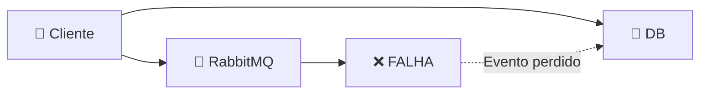
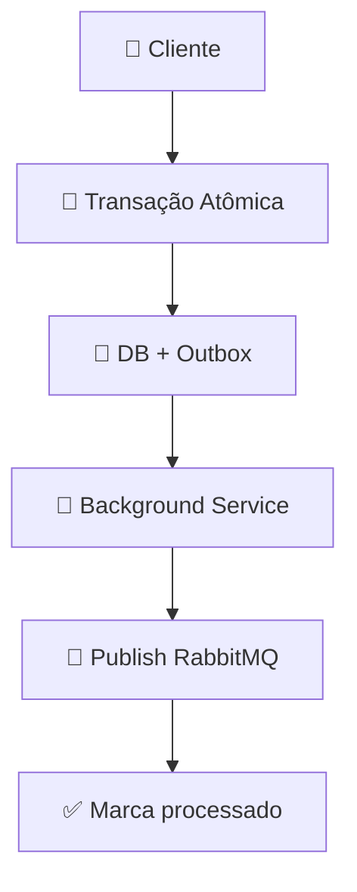

## Introdução

O **Outbox Pattern** resolve o problema do **dual write**: como salvar no banco E publicar no message broker de forma **atômica**? Se um falha, você perde dados.

Solução: salve o evento numa tabela `Outbox` na **mesma transação** do banco. Um background service lê e publica depois. Garante **at-least-once delivery** sem código distribuído complexo.

## Conceitos principais

### O problema: dual write



**Resultado**: evento perdido, DB inconsistente ❌

### A solução: outbox



**Resultado**: evento **sempre** entregue, DB consistente ✅

### Garantias

- **Atomicidade:** Evento sempre salvo com dados
- **Idempotência:** Consumer recebe duplicatas, ignora (via idempotency key)
- **Ordering:** Pubsub mantém ordem por partition

## Na prática

### Schema do Outbox

```sql
CREATE TABLE [Outbox] (
    [Id] BIGINT PRIMARY KEY IDENTITY,
    [AggregateId] NVARCHAR(50) NOT NULL,
    [EventType] NVARCHAR(100) NOT NULL,
    [Payload] NVARCHAR(MAX) NOT NULL,
    [IdempotencyKey] NVARCHAR(100) UNIQUE,
    [CreatedAt] DATETIME DEFAULT GETUTCDATE(),
    [PublishedAt] DATETIME NULL
);
```

### Publicando com Outbox

```csharp
public class OrderService
{
    private readonly AppDbContext _db;

    public async Task CreateOrder(CreateOrderRequest req)
    {
        using var tx = await _db.Database.BeginTransactionAsync();

        try
        {
            // 1. Salva ordem
            var order = new Order { ... };
            _db.Orders.Add(order);
            await _db.SaveChangesAsync();

            // 2. Insere evento no Outbox (mesma transação!)
            var @event = new OutboxEvent
            {
                AggregateId = order.Id.ToString(),
                EventType = "OrderCreated",
                Payload = JsonSerializer.Serialize(new OrderCreatedEvent(order)),
                IdempotencyKey = Guid.NewGuid().ToString()
            };
            _db.Outbox.Add(@event);
            await _db.SaveChangesAsync();

            await tx.CommitAsync();
        }
        catch
        {
            await tx.RollbackAsync();
            throw;
        }
    }
}
```

### Background service que publica

```csharp
public class OutboxPublisher : BackgroundService
{
    private readonly IServiceScopeFactory _scopeFactory;
    private readonly IPublisher _publisher;

    protected override async Task ExecuteAsync(CancellationToken ct)
    {
        while (!ct.IsCancellationRequested)
        {
            try
            {
                await PublishUnpublishedEvents(ct);
                await Task.Delay(TimeSpan.FromSeconds(5), ct);
            }
            catch (Exception ex)
            {
                _logger.LogError(ex, "Outbox publisher failed");
            }
        }
    }

    private async Task PublishUnpublishedEvents(CancellationToken ct)
    {
        using var scope = _scopeFactory.CreateScope();
        var db = scope.ServiceProvider.GetRequiredService<AppDbContext>();

        var unpublished = await db.Outbox
            .Where(e => e.PublishedAt == null)
            .OrderBy(e => e.Id)
            .Take(100)
            .ToListAsync(ct);

        foreach (var @event in unpublished)
        {
            try
            {
                // Publica para RabbitMQ/Service Bus
                await _publisher.PublishAsync(
                    routingKey: @event.EventType.ToLower(),
                    message: @event.Payload,
                    idempotencyKey: @event.IdempotencyKey
                );

                @event.PublishedAt = DateTime.UtcNow;
                await db.SaveChangesAsync(ct);

                _logger.LogInformation($"Published event {event.Id}");
            }
            catch (Exception ex)
            {
                _logger.LogError(ex, $"Failed to publish event {event.Id}");
                // Retry na próxima iteração
            }
        }
    }
}
```

### Consumer idempotente

```csharp
public class OrderCreatedEventHandler
{
    private readonly IIdempotencyStore _idempotency;
    private readonly EmailService _email;

    public async Task Handle(OrderCreatedEvent @event, string idempotencyKey)
    {
        // Verifica se já processou
        if (await _idempotency.ExistsAsync(idempotencyKey))
        {
            _logger.LogInformation($"Event {idempotencyKey} já processado, ignorando");
            return;
        }

        try
        {
            // Processa evento
            await _email.SendOrderConfirmationAsync(@event.Order);

            // Marca como processado
            await _idempotency.MarkProcessedAsync(idempotencyKey);
        }
        catch (Exception ex)
        {
            _logger.LogError(ex, "Failed to handle OrderCreated");
            throw; // Nack → requeue
        }
    }
}
```

## Armadilhas comuns

❌ **Não implementar idempotência no consumer** → Duplicatas causam bugs

❌ **Deletar Outbox muito rápido** → Manter 7+ dias para auditoria

❌ **Não monitorar lag** → Outbox crescendo = consumer falhando

❌ **Usar FIFO sem partition** → Serializa tudo (gargalo)

❌ **Não ter retry com backoff** → Conexão temporária falha = perda permanente

## Referências

- [Chris Richardson — Transactional Outbox](https://microservices.io/patterns/data/transactional-outbox.html)
- [Event Sourcing & CQRS](https://martinfowler.com/bliki/CQRS.html)
- [Debezium — CDC](https://debezium.io/)

## Ver também

- [Saga Pattern](./saga.md)
- [Messaging Patterns](../messaging/messaging-patterns.md)
- [Resilience com Polly](./resilience.md)
- [CQRS e Event Sourcing](../arquitetura/cqrs.md)
