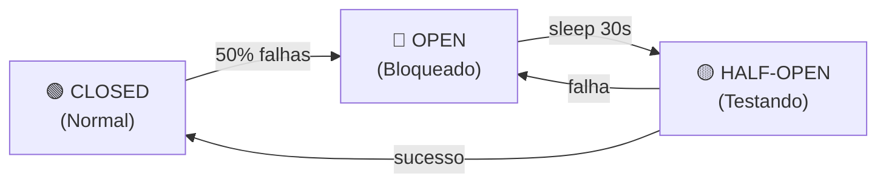

## Introdução

**Polly** é a biblioteca .NET de resiliência. Implementa padrões como retry, timeout, circuit breaker e bulkhead para lidar com falhas transientes e cascatas.

**Por que importa:** Sem retry, uma falha de rede = erro. Com retry + jitter, falha transiente é absorvida. Circuit breaker evita pedir pra um serviço quebrado.

## Conceitos principais

### Retry com backoff

```
Tentativa 1: agora
Tentativa 2: 100ms depois
Tentativa 3: 400ms depois  (exponencial: 2^n × 100)
Tentativa 4: 1600ms depois
```

**Sem jitter (problema):** 10.000 clientes falham → todos tentam de novo ao mesmo tempo = "thundering herd" → servidor derruba

**Com jitter:** adiciona randomização → spread no tempo = servidor respira

```
Sem jitter: retry em 1000ms
Com jitter: retry em 800ms-1200ms (aleatório)
```

### Circuit breaker

Estados:

- **Closed:** normal, requisições passam
- **Open:** muitas falhas detectadas → bloqueia requisições
- **Half-open:** testando se recuperou → deixa 1 passar



## Na prática

### Retry simples

```csharp
var policy = Policy
    .Handle<HttpRequestException>()
    .Or<TimeoutRejectedException>()
    .WaitAndRetry(
        retryCount: 3,
        sleepDurationProvider: retryAttempt =>
            TimeSpan.FromMilliseconds(Math.Pow(2, retryAttempt) * 100),
        onRetry: (outcome, timespan, retryCount, context) =>
            _logger.LogWarning($"Retry {retryCount} after {timespan.Ms}ms")
    );

var response = await policy.ExecuteAsync(() =>
    _httpClient.GetAsync("https://api.example.com/data"));
```

### Retry + jitter (recomendado)

```csharp
var policy = Policy
    .Handle<HttpRequestException>()
    .Or<TimeoutRejectedException>()
    .WaitAndRetry(
        retryCount: 4,
        sleepDurationProvider: retryAttempt =>
        {
            var exponentialBackoff = TimeSpan.FromMilliseconds(
                Math.Pow(2, retryAttempt) * 100);

            var jitter = TimeSpan.FromMilliseconds(
                _random.Next(0, (int)exponentialBackoff.TotalMilliseconds));

            return exponentialBackoff.Add(jitter);
        }
    );
```

### Circuit breaker

```csharp
var circuitBreaker = Policy
    .Handle<HttpRequestException>()
    .OrResult<HttpResponseMessage>(r => !r.IsSuccessStatusCode)
    .CircuitBreaker(
        handledEventsAllowedBeforeBreaking: 5,
        durationOfBreak: TimeSpan.FromSeconds(30),
        onBreak: (outcome, duration) =>
            _logger.LogError($"Circuit aberto por {duration.Seconds}s")
    );

var response = await circuitBreaker.ExecuteAsync(() =>
    _httpClient.GetAsync("https://api.example.com/data"));
```

### Combinado: Retry + Circuit Breaker

```csharp
// Retry em caso de transiente
var retryPolicy = Policy
    .Handle<HttpRequestException>()
    .WaitAndRetry(3, attempt =>
        TimeSpan.FromMilliseconds(Math.Pow(2, attempt) * 100 + _random.Next(0, 100)));

// Circuit breaker em caso de falha persistente
var circuitPolicy = Policy
    .Handle<HttpRequestException>()
    .OrResult<HttpResponseMessage>(r => (int)r.StatusCode >= 500)
    .CircuitBreaker(5, TimeSpan.FromSeconds(30));

// Combina: tenta com retry, se tudo falha abre circuit
var policy = Policy.WrapAsync(retryPolicy, circuitPolicy);

try
{
    var response = await policy.ExecuteAsync(() =>
        _httpClient.GetAsync("https://api.example.com/data"));
}
catch (BrokenCircuitException)
{
    _logger.LogError("Serviço indisponível, circuit aberto");
    return CachedResponse(); // fallback
}
```

### Com registro em DI

```csharp
services.AddHttpClient<PaymentService>()
    .AddPolicyHandler(GetRetryPolicy())
    .AddPolicyHandler(GetCircuitBreakerPolicy())
    .AddTransientHttpErrorPolicy(p =>
        p.WaitAndRetryAsync(3, _ => TimeSpan.FromMilliseconds(100)));

static IAsyncPolicy<HttpResponseMessage> GetRetryPolicy() =>
    HttpPolicyExtensions
        .HandleTransientHttpError()
        .WaitAndRetryAsync(3, retryAttempt =>
            TimeSpan.FromMilliseconds(Math.Pow(2, retryAttempt) * 100));

static IAsyncPolicy<HttpResponseMessage> GetCircuitBreakerPolicy() =>
    HttpPolicyExtensions
        .HandleTransientHttpError()
        .CircuitBreakerAsync(5, TimeSpan.FromSeconds(30));
```

## Armadilhas comuns

❌ **Retry sem jitter** → Thundering herd mata o servidor

❌ **Circuit breaker sem half-open** → Nunca se recupera

❌ **Timeout muito alto** → Espera cliente enquanto serviço está morto

❌ **Retry em operações não-idempotentes** → Duplica transações (use idempotency key)

❌ **Não logar falhas** → Impossível debugar em prod

## Referências

- [GitHub Polly](https://github.com/App-vNext/Polly)
- [Microsoft Docs — Resilience](https://docs.microsoft.com/en-us/dotnet/architecture/microservices/implement-resilient-applications/implement-resilient-http-call-handling-with-polly)
- [Release It! — Michael Nygard](https://pragprog.com/titles/mnee2/release-it-second-edition/)

## Ver também

- [Saga Pattern](./saga.md)
- [Outbox Pattern](./outbox.md)
- [Feature Flags](./feature-flags.md)
- [Strangler Fig Pattern](./strangler-fig.md)
- [Caching](../aspnet/caching.md)
