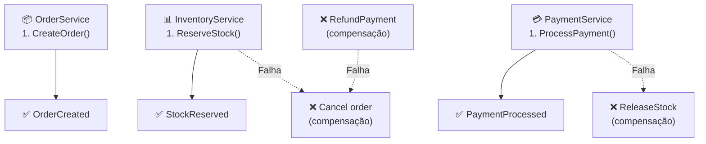

## Introdução

O **Saga Pattern** resolve como fazer transações **distribuídas** quando não temos ACID clássico (2PC é slow/unreliable). Em vez de "tudo ou nada", use **compensating transactions**: se algo falha, desfaça os passos anteriores.

Exemplo: criar pedido → reservar estoque → processar pagamento → enviar confirmação. Se pagamento falha, cancelar reserva.

## Conceitos principais

### Dois estilos

**1. Choreography (event-driven)**

- Cada serviço publica evento → próximo serviço escuta
- Descentralizado, mas difícil de debugar
- Bom para fluxos simples

**2. Orchestration (command-driven)**

- Orquestrador central comanda cada passo
- Explícito, fácil entender fluxo
- Escalável com MediatR/Masstransit

### Estados e compensação



## Na prática

### Orchestration com MediatR

```csharp
public class CreateOrderCommand : IRequest<OrderResponse>
{
    public int UserId { get; set; }
    public List<OrderItem> Items { get; set; }
}

public class CreateOrderHandler : IRequestHandler<CreateOrderCommand, OrderResponse>
{
    private readonly IMediator _mediator;
    private readonly ILogger<CreateOrderHandler> _logger;

    public async Task<OrderResponse> Handle(CreateOrderCommand req, CancellationToken ct)
    {
        var orderId = Guid.NewGuid();
        var compensation = new List<Func<Task>>();

        try
        {
            // 1. Criar ordem
            var order = await _mediator.Send(
                new CreateOrderInternalCommand { Id = orderId, Items = req.Items }, ct);
            compensation.Add(() => RollbackOrder(orderId));

            // 2. Reservar estoque
            await _mediator.Send(
                new ReserveStockCommand { OrderId = orderId, Items = req.Items }, ct);
            compensation.Add(() => ReleaseStock(orderId));

            // 3. Processar pagamento
            await _mediator.Send(
                new ProcessPaymentCommand { OrderId = orderId, Amount = order.Total }, ct);
            compensation.Add(() => RefundPayment(orderId));

            // 4. Enviar confirmação
            await _mediator.Send(new SendOrderConfirmationCommand { OrderId = orderId }, ct);

            return new OrderResponse { Id = orderId, Status = "Confirmed" };
        }
        catch (Exception ex)
        {
            _logger.LogError(ex, "Saga failed for order {OrderId}, rolling back", orderId);

            // Executar compensações na ordem inversa
            foreach (var comp in Enumerable.Reverse(compensation))
            {
                try
                {
                    await comp();
                }
                catch (Exception compEx)
                {
                    _logger.LogError(compEx, "Compensation failed");
                    // Registrar para manual recovery
                }
            }

            throw;
        }
    }

    private async Task RollbackOrder(Guid orderId) =>
        await _mediator.Send(new CancelOrderCommand { Id = orderId });

    private async Task ReleaseStock(Guid orderId) =>
        await _mediator.Send(new ReleaseStockCommand { OrderId = orderId });

    private async Task RefundPayment(Guid orderId) =>
        await _mediator.Send(new RefundPaymentCommand { OrderId = orderId });
}
```

### Choreography com eventos

```csharp
public class OrderCreatedEventHandler : INotificationHandler<OrderCreated>
{
    private readonly InventoryService _inventory;

    public async Task Handle(OrderCreated @event, CancellationToken ct)
    {
        try
        {
            await _inventory.ReserveStockAsync(@event.OrderId, @event.Items);
        }
        catch
        {
            // Publica evento de compensação
            await _mediator.Publish(new OrderCancelled { OrderId = @event.OrderId });
        }
    }
}

public class StockReservedEventHandler : INotificationHandler<StockReserved>
{
    private readonly PaymentService _payment;

    public async Task Handle(StockReserved @event, CancellationToken ct)
    {
        try
        {
            await _payment.ProcessPaymentAsync(@event.OrderId, @event.Total);
        }
        catch
        {
            await _mediator.Publish(new StockReleasedCommand { OrderId = @event.OrderId });
        }
    }
}
```

## Armadilhas comuns

❌ **Tentar fazer Saga com 2PC/transações distribuídas** → Usa compensação

❌ **Não implementar compensação** → Sistema fica inconsistente

❌ **Choreography sem logging** → Impossível debugar fluxo

❌ **Compensação que falha** → Precisa de manual recovery + alertas

❌ **Ignorar idempotência** → Retry de compensação duplica desfazimento

## Referências

- [Chris Richardson — Saga Pattern](https://microservices.io/patterns/data/saga.html)
- [MassTransit Sagas](https://masstransit.io/documentation/patterns/saga)
- [Eventuate](https://eventuate.io/)

## Ver também

- [Outbox Pattern](./outbox.md)
- [Messaging Patterns](../messaging/messaging-patterns.md)
- [Resilience com Polly](./resilience.md)
- [CQRS e Event Sourcing](../arquitetura/cqrs.md)
