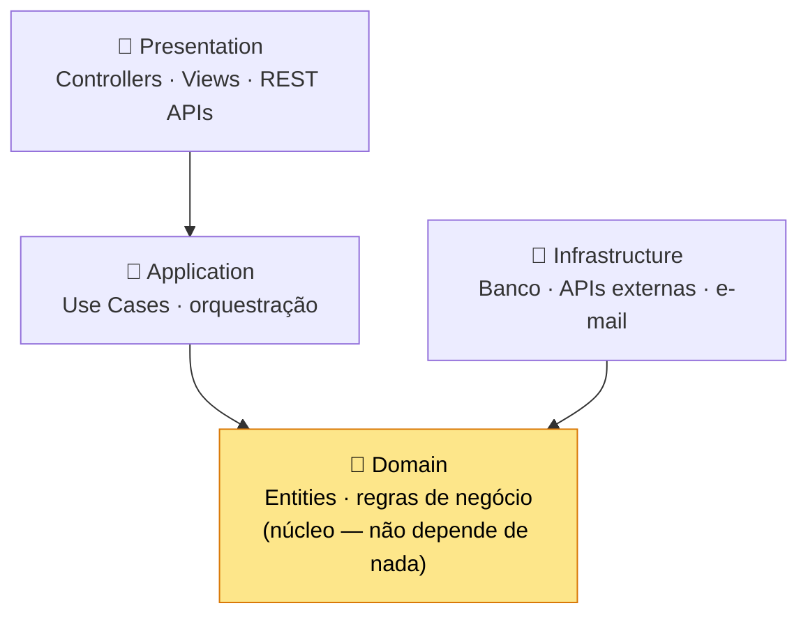
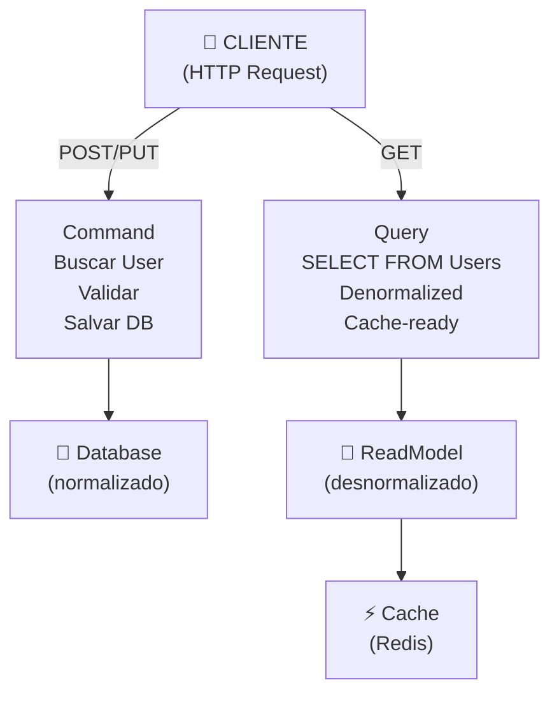
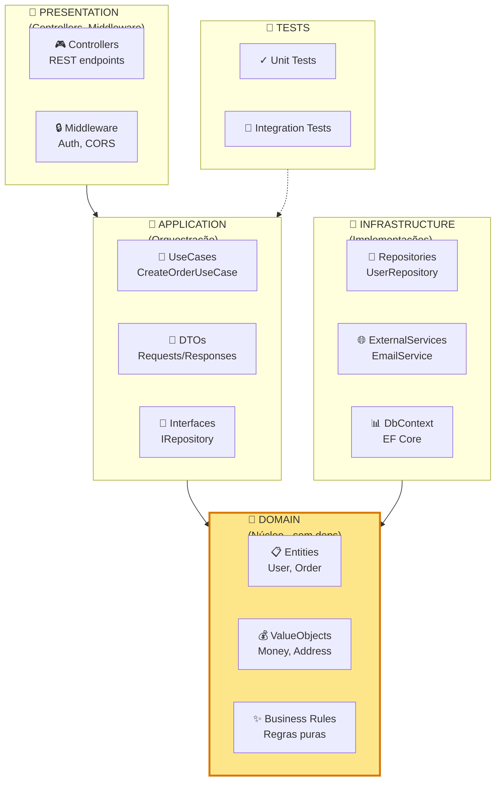

import { Tabs, TabItem } from "@astrojs/starlight/components";
import { Aside } from "@astrojs/starlight/components";

## Introdução

Clean Architecture é um padrão que organiza seu código em **camadas independentes**, facilitando manutenção, testes e escalabilidade. Essencial em projetos .NET de longo prazo.

<Aside type="tip" title="Por que importa?">
  Clean Architecture deixa seu código testável, independente de frameworks e fácil de manter. Uma
  estrutura ruim custa muito caro depois.
</Aside>

---

## Clean Architecture — As 4 Camadas



📌 **Regra de ouro:** as dependências apontam **para dentro**, em direção ao Domain ➡️

### Camada 1: Domain (centro)

Contém **regras de negócio puras** — não tem dependências externas.

```csharp
// ✅ Domain (Core)
namespace CleanArch.Domain
{
    public abstract class Entity
    {
        public int Id { get; protected set; }
    }

    public class User : Entity
    {
        public string Email { get; private set; }
        public string PasswordHash { get; private set; }
        public bool IsActive { get; private set; }

        // ✨ Regra de negócio PURA — sem dependências
        public void ChangePassword(string newPassword)
        {
            if (newPassword.Length < 8)
                throw new DomainException("Senha deve ter 8+ caracteres");

            PasswordHash = HashPassword(newPassword);
        }

        private string HashPassword(string password)
        {
            // Lógica simples, sem dependências
            return Convert.ToBase64String(
                System.Security.Cryptography.SHA256.HashData(
                    System.Text.Encoding.UTF8.GetBytes(password)
                )
            );
        }
    }
}
```

### Camada 2: Application (casos de uso)

Orquestra o **fluxo** entre domain e infrastructure.

```csharp
// ✅ Application (Use Cases)
namespace CleanArch.Application
{
    public interface IUserRepository
    {
        Task<User> GetByIdAsync(int id);
        Task UpdateAsync(User user);
    }

    public class ChangePasswordUseCase
    {
        private readonly IUserRepository _userRepo;

        public ChangePasswordUseCase(IUserRepository userRepo)
        {
            _userRepo = userRepo;
        }

        public async Task ExecuteAsync(int userId, string newPassword)
        {
            // 1. Buscar usuário (infrastructure)
            var user = await _userRepo.GetByIdAsync(userId);
            if (user is null)
                throw new NotFoundException("Usuário não encontrado");

            // 2. Aplicar regra de negócio (domain)
            user.ChangePassword(newPassword);

            // 3. Salvar (infrastructure)
            await _userRepo.UpdateAsync(user);
        }
    }
}
```

### Camada 3: Infrastructure (detalhes)

Implementa **como** buscar/salvar dados.

```csharp
// ✅ Infrastructure (Implementações)
namespace CleanArch.Infrastructure
{
    public class UserRepository : IUserRepository
    {
        private readonly DbContext _db;

        public UserRepository(DbContext db) => _db = db;

        public async Task<User> GetByIdAsync(int id)
        {
            return await _db.Users.FirstOrDefaultAsync(u => u.Id == id);
        }

        public async Task UpdateAsync(User user)
        {
            _db.Users.Update(user);
            await _db.SaveChangesAsync();
        }
    }
}
```

### Camada 4: Presentation (HTTP)

Expõe **endpoints** — não sabe de regras de negócio.

```csharp
// ✅ Presentation (API)
namespace CleanArch.Presentation
{
    [ApiController]
    [Route("api/[controller]")]
    public class UsersController : ControllerBase
    {
        private readonly ChangePasswordUseCase _useCase;

        public UsersController(ChangePasswordUseCase useCase)
        {
            _useCase = useCase;
        }

        [HttpPost("{userId}/change-password")]
        public async Task<IActionResult> ChangePassword(
            int userId,
            [FromBody] ChangePasswordRequest request)
        {
            await _useCase.ExecuteAsync(userId, request.NewPassword);
            return Ok("Senha alterada com sucesso");
        }
    }
}
```

---

## Repository Pattern

**O quê:** Abstração que encapsula **acesso a dados**.

**Por quê:** Facilita testes (mock fácil) e trocar de banco de dados depois.

<Tabs>
  <TabItem label="❌ Sem Repository">
```csharp
// Controlador conhece TUDO sobre o banco
[ApiController]
public class OrdersController : ControllerBase
{
    private readonly DbContext _db;

    [HttpGet("{id}")]
    public async Task<Order> GetOrder(int id)
    {
        // Lógica de banco AQUI — não testável, acoplado
        return await _db.Orders
            .Include(o => o.Items)
            .Include(o => o.Customer)
            .FirstOrDefaultAsync(o => o.Id == id);
    }

}

// Testes? Imposível sem real database
var controller = new OrdersController(realDatabase);

````
  </TabItem>

  <TabItem label="✅ Com Repository">
```csharp
// Interface — apenas contrato
public interface IOrderRepository
{
    Task<Order> GetByIdAsync(int id);
}

// Controlador NÃO sabe como buscar
[ApiController]
public class OrdersController : ControllerBase
{
    private readonly IOrderRepository _orderRepo;

    [HttpGet("{id}")]
    public async Task<Order> GetOrder(int id)
    {
        return await _orderRepo.GetByIdAsync(id);
    }
}

// Testes? FÁCIL com mock
[Test]
public async Task Should_Return_Order_When_Exists()
{
    var mockRepo = new Mock<IOrderRepository>();
    mockRepo.Setup(r => r.GetByIdAsync(1))
        .ReturnsAsync(new Order { Id = 1 });

    var controller = new OrdersController(mockRepo.Object);
    var result = await controller.GetOrder(1);

    Assert.IsNotNull(result);
}
````

  </TabItem>
</Tabs>

---

## Unit of Work Pattern

**O quê:** Coordena **múltiplos repositories** em uma transação.

**Quando:** Você precisa salvar dados em múltiplas tabelas atomicamente (tudo ou nada).

```csharp
// Interface — contrato
public interface IUnitOfWork : IDisposable
{
    IUserRepository Users { get; }
    IOrderRepository Orders { get; }
    IPaymentRepository Payments { get; }

    Task<int> SaveChangesAsync();
}

// Implementação
public class UnitOfWork : IUnitOfWork
{
    private readonly DbContext _db;

    public IUserRepository Users { get; }
    public IOrderRepository Orders { get; }
    public IPaymentRepository Payments { get; }

    public UnitOfWork(DbContext db)
    {
        _db = db;
        Users = new UserRepository(db);
        Orders = new OrderRepository(db);
        Payments = new PaymentRepository(db);
    }

    public async Task<int> SaveChangesAsync()
    {
        // Salva TUDO de uma vez — transação atômica
        return await _db.SaveChangesAsync();
    }
}

// USO: Garantir consistência
public class CreateOrderUseCase
{
    private readonly IUnitOfWork _unitOfWork;

    public async Task ExecuteAsync(CreateOrderRequest request)
    {
        using (var transaction = await _unitOfWork.BeginTransactionAsync())
        {
            try
            {
                // 1. Criar pedido
                var order = new Order { /* ... */ };
                await _unitOfWork.Orders.AddAsync(order);

                // 2. Processar pagamento
                var payment = new Payment { /* ... */ };
                await _unitOfWork.Payments.AddAsync(payment);

                // 3. Salvar TUDO junto (atômico)
                await _unitOfWork.SaveChangesAsync();

                await transaction.CommitAsync();
            }
            catch
            {
                await transaction.RollbackAsync();
                throw;
            }
        }
    }
}
```

---

## CQRS — Command Query Responsibility Segregation

**O quê:** Separa **leitura** (Query) de **escrita** (Command).

**Por quê:** Queries podem ser otimizadas diferente de Commands. E segurança?



📌 **Commands** = Escrita + validação  
📌 **Queries** = Leitura + performance

<Tabs>
  <TabItem label="❌ Sem CQRS">
```csharp
// Mesma model para ler e escrever (ineficiente)
public class UserModel
{
    public int Id { get; set; }
    public string Email { get; set; }
    public string PasswordHash { get; set; } // ❌ Não precisa em leitura!
    public ICollection<OrderModel> Orders { get; set; } // ❌ N+1!
    public DateTime CreatedAt { get; set; }
    // ... 20 campos mais...
}

[HttpGet("users")]
public async Task<List<UserModel>> GetUsers()
{
// ❌ Retorna TUDO, incluindo PasswordHash!
return await \_db.Users.ToListAsync();
}

````
  </TabItem>

  <TabItem label="✅ Com CQRS">
```csharp
// Command: Escrita com validações
public class CreateUserCommand
{
    public string Email { get; set; }
    public string Password { get; set; }
}

public class CreateUserHandler
{
    public async Task Handle(CreateUserCommand cmd)
    {
        // ✅ Validar, normalizar, salvar
        var user = new User(cmd.Email, HashPassword(cmd.Password));
        await _userRepo.AddAsync(user);
    }
}

// Query: Leitura otimizada (denormalizada)
public class UserReadModel
{
    public int Id { get; set; }
    public string Email { get; set; }
    public string DisplayName { get; set; }
    public int OrderCount { get; set; } // ✅ Pré-agregado
    // SEM PasswordHash, SEM Orders collection
}

[HttpGet("users")]
public async Task<List<UserReadModel>> GetUsers()
{
    // ✅ Buscar diretamente de view desnormalizada/cache
    return await _readModelDb.UserReadModels.ToListAsync();
}
````

  </TabItem>
</Tabs>

<Aside type="caution" title="CQRS não é sempre necessário">
  Use CQRS quando você tem reads e writes com padrões muito diferentes. Para CRUD simples, é
  overengineering.
</Aside>

---

## Comparativo: Qual padrão usar?

| Padrão           | Complexidade        | Quando usar                   | Exemplo                            |
| ---------------- | ------------------- | ----------------------------- | ---------------------------------- |
| **Repository**   | ⭐ Baixa            | Sempre (isolamento de dados)  | `IUserRepository`                  |
| **Unit of Work** | ⭐⭐ Média          | Multi-agregados em transação  | Pedido + Pagamento + Estoque       |
| **CQRS**         | ⭐⭐⭐ Alta         | Reads/writes muito diferentes | E-commerce (1k reads vs 10 writes) |
| **Clean Arch**   | ⭐⭐⭐⭐ Muito alta | Projetos grandes, longo prazo | Sistemas empresariais              |

---

## Na prática: Projeto completo

Estrutura recomendada de pastas:



**Startup.cs (Dependency Injection)**

```csharp
var builder = WebApplication.CreateBuilder(args);

// 🔌 Infrastructure
builder.Services.AddScoped<DbContext>();
builder.Services.AddScoped<IUserRepository, UserRepository>();

// 💼 Application
builder.Services.AddScoped<ChangePasswordUseCase>();

// 🎯 Presentation
builder.Services.AddControllers();

var app = builder.Build();
app.MapControllers();
app.Run();
```

---

## Referências

- [Clean Architecture — Uncle Bob](https://blog.cleancoder.com/uncle-bob/2012/08/13/the-clean-architecture.html)
- [CQRS Pattern](https://learn.microsoft.com/en-us/azure/architecture/patterns/cqrs)
- [Repository Pattern em .NET](https://learn.microsoft.com/en-us/dotnet/architecture/microservices/microservice-ddd-cqrs-patterns/infrastructure-persistence-layer-design)
- [Unit of Work Pattern](https://martinfowler.com/eaaCatalog/unitOfWork.html)
