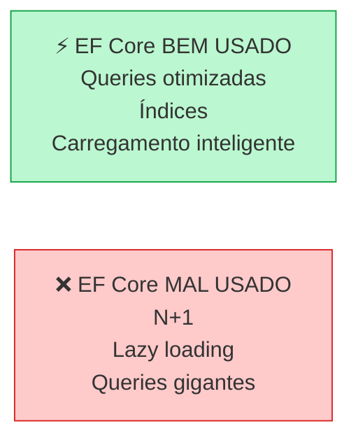
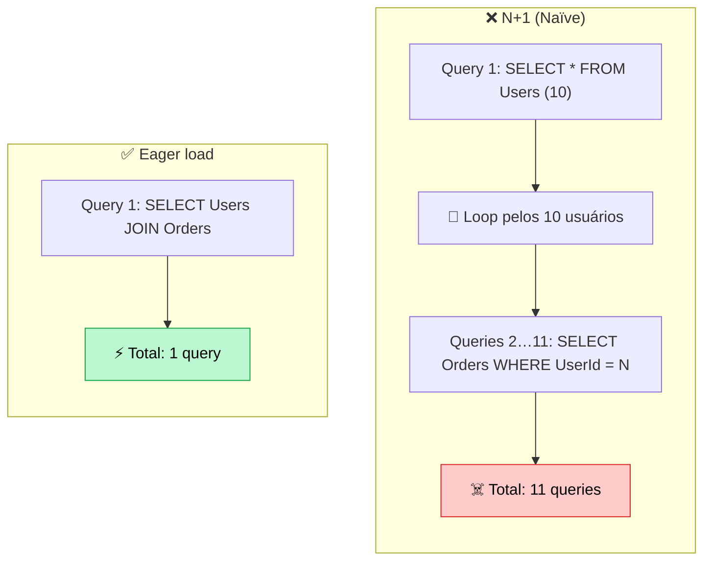

import { Tabs, TabItem } from '@astrojs/starlight/components';
import { Aside } from '@astrojs/starlight/components';

## Introdução

**Entity Framework Core é poderoso, mas pode ficar LENTO rápido.** A maioria dos problemas é culpa do desenvolvedor, não do framework.



<Aside type="caution" title="Performance importa!">
Uma query ruim em produção com 1M de registros = aplicação travada. AppSec também cobra isso em entrevistas.
</Aside>

---

## O Problema N+1

A **TRAP** mais comum do EF Core.



<Tabs>
  <TabItem label="❌ N+1 Problem">
```csharp
// ❌ RUINS
public async Task<List<UserDto>> GetUsersWithOrders()
{
    var users = await _db.Users
        .ToListAsync(); // Query 1: SELECT * FROM Users
    
    foreach (var user in users)
    {
        user.Orders = await _db.Orders
            .Where(o => o.UserId == user.Id)
            .ToListAsync(); // Query 2, 3, 4... N+1 queries!
    }
    
    return users.Select(u => new UserDto(u)).ToList();
}

// Resultado: Se 100 usuários = 101 queries! 🔥
```
  </TabItem>

  <TabItem label="✅ Eager Loading">
```csharp
// ✅ BOM - Eager Load com Include
public async Task<List<UserDto>> GetUsersWithOrders()
{
    var users = await _db.Users
        .Include(u => u.Orders) // ✅ Carrega orders junto
        .ToListAsync(); // Apenas 1 query com JOIN!
    
    return users.Select(u => new UserDto(u)).ToList();
}

// Resultado: 100 usuários = 1 query! ⚡

// Múltiplos levels
var users = await _db.Users
    .Include(u => u.Orders)
        .ThenInclude(o => o.Items)
    .Include(u => u.Addresses)
    .ToListAsync(); // 1 query, tudo!
```
  </TabItem>
</Tabs>

---

## AsNoTracking — Quando Não Precisa Atualizar

EF Core **rastreia mudanças por padrão**. Isso custa CPU/RAM. Se você SÓ quer LER, desative.

<Tabs>
  <TabItem label="❌ Rastreando (Overhead)">
```csharp
// Padrão: EF rastreia tudo
var users = await _db.Users.ToListAsync();

// EF internamente:
// ├─ Salva estado original de cada User
// ├─ Monitora mudanças
// ├─ Prepara UPDATE query se modificar
// └─ 💾 Usa mais RAM

// Se você não vai modificar, é desperdício!
```
  </TabItem>

  <TabItem label="✅ AsNoTracking (Rápido)">
```csharp
// ✅ Sem rastreamento (leitura pura)
var users = await _db.Users
    .AsNoTracking() // 🚀 Sem overhead
    .ToListAsync();

// EF internamente:
// ├─ Pega dados
// └─ Pronto! Sem rastreamento

// QUANDO USAR:
// ✅ Endpoints de leitura (GET)
// ✅ Relatórios
// ✅ Dados para exibir em UI
// ❌ NÃO usar se vai modificar
```
  </TabItem>
</Tabs>

---

## Query Projection — Não Puxar Tudo

Trazer apenas os campos que precisa.

<Tabs>
  <TabItem label="❌ Puxando Tudo">
```csharp
// ❌ Pega User inteiro (com dados sensíveis)
var users = await _db.Users.ToListAsync();

// SELECT * FROM Users
// ├─ Id, Email, PasswordHash, CreatedAt, UpdatedAt
// ├─ Secret, ApiKey, PrivateNotes
// └─ Tudo! 😱

var result = users.Select(u => new
{
    u.Id,
    u.Email
}).ToList(); // Já tarde! Dados já em memória
```
  </TabItem>

  <TabItem label="✅ Projection (Query Level)">
```csharp
// ✅ SELECT apenas o necessário
var users = await _db.Users
    .AsNoTracking()
    .Select(u => new // 🎯 Projection no BANCO
    {
        u.Id,
        u.Email
    })
    .ToListAsync();

// SELECT Id, Email FROM Users
// Apenas 2 colunas! Mais rápido.

// Tipo seguro com DTO
var userDtos = await _db.Users
    .AsNoTracking()
    .Select(u => new UserDto
    {
        Id = u.Id,
        Email = u.Email,
        OrderCount = u.Orders.Count()
    })
    .ToListAsync();
```
  </TabItem>
</Tabs>

---

## Índices de Banco de Dados

EF Core sem índices = **table scan** (checa toda tabela). Lento!

```csharp
// Modelar com Fluent API
protected override void OnModelCreating(ModelBuilder modelBuilder)
{
    modelBuilder.Entity<User>()
        .HasIndex(u => u.Email)
        .IsUnique(); // Email é único
    
    modelBuilder.Entity<Order>()
        .HasIndex(o => o.UserId); // Buscar por UserId frequente
    
    modelBuilder.Entity<Order>()
        .HasIndex(o => new { o.UserId, o.CreatedAt }) // Índice composto
        .HasDatabaseName("IX_Order_UserIdDate");
}

// SQL gerado:
// CREATE UNIQUE INDEX IX_User_Email ON Users(Email);
// CREATE INDEX IX_Order_UserId ON Orders(UserId);
```

```
┌──────────────────────────────┐
│ Sem índice (❌)               │
├──────────────────────────────┤
│ SELECT * FROM Users          │
│ WHERE Email = 'a@b.com'      │
│                              │
│ ❌ Table scan                │
│ ├─ Checa 1.000.000 linhas   │
│ ├─ Encontra 1 resultado     │
│ └─ Demora 5 segundos!       │
└──────────────────────────────┘

┌──────────────────────────────┐
│ Com índice (✅)               │
├──────────────────────────────┤
│ SELECT * FROM Users          │
│ WHERE Email = 'a@b.com'      │
│                              │
│ ✅ Index lookup (B-tree)    │
│ ├─ Direto ao resultado      │
│ └─ Demora 1ms! ⚡           │
└──────────────────────────────┘
```

---

## Paginação — Nunca Puxe TUDO

```csharp
// ❌ PÉSSIMO
public async Task<List<User>> GetAllUsers()
{
    return await _db.Users.ToListAsync(); // Se tiver 1M = crash!
}

// ✅ BOM
public async Task<PagedResult<UserDto>> GetUsers(int page = 1, int pageSize = 10)
{
    var query = _db.Users.AsNoTracking();
    
    var total = await query.CountAsync();
    
    var items = await query
        .Skip((page - 1) * pageSize)
        .Take(pageSize)
        .Select(u => new UserDto { Id = u.Id, Email = u.Email })
        .ToListAsync();
    
    return new PagedResult<UserDto>
    {
        Items = items,
        Total = total,
        Page = page,
        PageSize = pageSize
    };
}

// SQL:
// SELECT COUNT(*) FROM Users
// SELECT * FROM Users ORDER BY Id OFFSET 0 ROWS FETCH NEXT 10 ROWS ONLY
```

---

## Lazy Loading — O Vilão Silencioso

```csharp
// ❌ PERIGOSO
public class User
{
    public int Id { get; set; }
    public virtual ICollection<Order> Orders { get; set; } // Lazy load!
}

var user = await _db.Users.FirstOrDefaultAsync(u => u.Id == 1);
var orderCount = user.Orders.Count; // ⚠️ Dispara query aqui (dentro do loop = N+1!)

foreach (var order in user.Orders) // ⚠️ Query extra
{
    Console.WriteLine(order.Id);
}

// ✅ MELHOR: Desativar lazy loading
services.AddDbContext<MyDbContext>(options =>
{
    options.UseSqlServer(connectionString);
    options.UseLazyLoadingProxies(false); // ✅ Desativa
});

// Obriga a usar Include explícito
var user = await _db.Users
    .Include(u => u.Orders)
    .FirstOrDefaultAsync(u => u.Id == 1); // Agora Orders já está carregado
```

---

## Compiled Queries — Queries Frequentes

Se executa mesma query muitas vezes, compile uma vez:

```csharp
// Definir query compilada
private static readonly Func<MyDbContext, int, Task<User>> GetUserById =
    EF.CompileAsyncQuery((MyDbContext db, int id) =>
        db.Users
            .AsNoTracking()
            .FirstOrDefault(u => u.Id == id)
    );

// Usar (mais rápido!)
public async Task<User> GetUser(int id)
{
    return await GetUserById(_db, id);
}

// Benefício: EF compila SQL uma vez, reutiliza
```

---

## Connection Pooling

Reutilize conexões em vez de criar novas:

```csharp
// ✅ Com pooling
services.AddDbContext<MyDbContext>(options =>
{
    var connString = "Server=localhost;...";
    
    options.UseSqlServer(connString, sqlOptions =>
    {
        sqlOptions.EnableRetryOnFailure(
            maxRetryCount: 3,
            maxRetryDelaySeconds: 30,
            errorNumbersToAdd: null
        );
    });
});

// Configuração de pool
services.AddSqlServer(
    connectionString,
    options =>
    {
        options.MaxPoolSize = 128; // Máx 128 conexões
        options.MinPoolSize = 5;   // Min 5 conexões
    }
);
```

---

## Batching de Updates

Múltiplas mudanças em um SaveChanges:

```csharp
// ❌ Lento (3 round-trips)
var user = await _db.Users.FindAsync(1);
user.Email = "new@email.com";
await _db.SaveChangesAsync();

var order = await _db.Orders.FindAsync(1);
order.Status = "Shipped";
await _db.SaveChangesAsync();

var payment = await _db.Payments.FindAsync(1);
payment.Processed = true;
await _db.SaveChangesAsync();

// ✅ Rápido (1 round-trip)
var user = await _db.Users.FindAsync(1);
user.Email = "new@email.com";

var order = await _db.Orders.FindAsync(1);
order.Status = "Shipped";

var payment = await _db.Payments.FindAsync(1);
payment.Processed = true;

await _db.SaveChangesAsync(); // Uma vez!
```

---

## Checklist de Performance

- [ ] ✅ Use `.AsNoTracking()` em queries de leitura
- [ ] ✅ Use `.Select()` (projection) não trazer tudo
- [ ] ✅ Use `.Include()` para eager loading, não lazy
- [ ] ✅ Adicione índices em colunas frequentes
- [ ] ✅ Implemente paginação (nunca puxe tudo)
- [ ] ✅ Use connection pooling
- [ ] ✅ Monitore queries com EF Core logging

---

## Na prática: Ferramenta de Debug

Ver queries reais sendo executadas:

```csharp
// Program.cs
services.AddDbContext<MyDbContext>(options =>
{
    options.UseSqlServer(connectionString);
    
    // Log todas as queries
    options.LogTo(Console.WriteLine, 
        new[] { DbLoggerCategory.Database.Command.Name }, 
        LogLevel.Information
    );
});

// Saída:
// Executing DbCommand [Parameters=[], CommandType='Text', CommandTimeout='30']
// SELECT * FROM Users WHERE Email = @p0
// Elapsed: 1ms
```

---

## Referências

- [EF Core Performance Best Practices](https://docs.microsoft.com/en-us/ef/core/performance/)
- [Preventing N+1 with Include](https://docs.microsoft.com/en-us/ef/core/querying/related-data)
- [AsNoTracking Performance](https://docs.microsoft.com/en-us/ef/core/querying/tracking)
- [SQL Server Indexing](https://learn.microsoft.com/en-us/sql/relational-databases/indexes/indexes)
