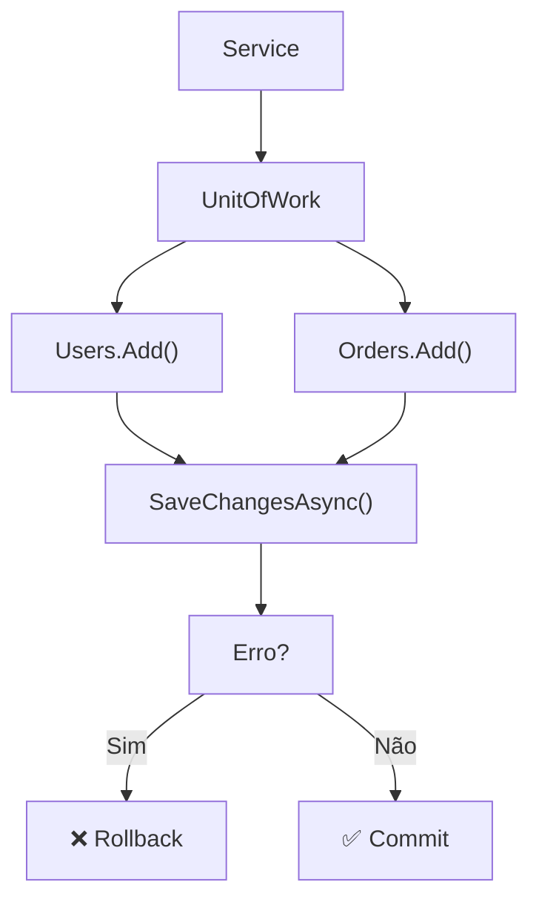

## Introdução

**Unit of Work** = orquestrador de transações. Agrupa múltiplos repositórios em uma transação atômica.

**Problema que resolve**: Salvar em User + Order com falha parcial = dados inconsistentes. UoW garante atomicidade (tudo ou nada).



---

## Padrão Completo

### Interface

```csharp
public interface IUnitOfWork : IDisposable, IAsyncDisposable
{
    // Repositórios
    IRepository<User> Users { get; }
    IRepository<Order> Orders { get; }
    IRepository<OrderItem> OrderItems { get; }

    // Transação
    Task SaveChangesAsync(CancellationToken ct = default);
    Task BeginTransactionAsync(CancellationToken ct = default);
    Task CommitAsync(CancellationToken ct = default);
    Task RollbackAsync(CancellationToken ct = default);

    // Estado
    bool HasChanges { get; }
}
```

### Implementação

```csharp
public class UnitOfWork : IUnitOfWork
{
    private readonly AppDbContext _context;
    private IDbContextTransaction _transaction;

    // Lazy-loaded repositories
    private IRepository<User> _users;
    private IRepository<Order> _orders;
    private IRepository<OrderItem> _orderItems;

    public UnitOfWork(AppDbContext context)
    {
        _context = context;
    }

    // Properties — lazy initialization
    public IRepository<User> Users
        => _users ??= new Repository<User>(_context);

    public IRepository<Order> Orders
        => _orders ??= new Repository<Order>(_context);

    public IRepository<OrderItem> OrderItems
        => _orderItems ??= new Repository<OrderItem>(_context);

    public bool HasChanges => _context.ChangeTracker.HasChanges();

    public async Task BeginTransactionAsync(CancellationToken ct)
    {
        _transaction = await _context.Database.BeginTransactionAsync(ct);
    }

    public async Task SaveChangesAsync(CancellationToken ct = default)
    {
        await _context.SaveChangesAsync(ct);
    }

    public async Task CommitAsync(CancellationToken ct = default)
    {
        try
        {
            await SaveChangesAsync(ct);
            if (_transaction != null)
                await _transaction.CommitAsync(ct);
        }
        catch
        {
            await RollbackAsync(ct);
            throw;
        }
    }

    public async Task RollbackAsync(CancellationToken ct = default)
    {
        try
        {
            if (_transaction != null)
                await _transaction.RollbackAsync(ct);
        }
        finally
        {
            await _transaction?.DisposeAsync();
        }
    }

    async ValueTask IAsyncDisposable.DisposeAsync()
    {
        await _transaction?.DisposeAsync();
        await _context.DisposeAsync();
    }

    void IDisposable.Dispose()
    {
        _transaction?.Dispose();
        _context.Dispose();
    }
}
```

---

## DI Setup (Scoped lifetime)

```csharp
builder.Services.AddScoped<IUnitOfWork, UnitOfWork>();

// ✅ Scoped = 1 instância por request HTTP
// Se Singleton → captive dependency!
```

---

## Uso em Service Layer

```csharp
public class OrderService
{
    private readonly IUnitOfWork _uow;

    public OrderService(IUnitOfWork uow) => _uow = uow;

    public async Task<Order> CreateOrderAsync(CreateOrderRequest req, CancellationToken ct)
    {
        await _uow.BeginTransactionAsync(ct);

        try
        {
            // 1. Criar usuário se novo
            var user = new User { Email = req.Email };
            _uow.Users.Add(user);
            await _uow.SaveChangesAsync(ct);

            // 2. Criar pedido (depende do user id)
            var order = new Order
            {
                UserId = user.Id,
                Total = req.Items.Sum(x => x.Price)
            };
            _uow.Orders.Add(order);
            await _uow.SaveChangesAsync(ct);

            // 3. Adicionar itens
            foreach (var item in req.Items)
            {
                var orderItem = new OrderItem
                {
                    OrderId = order.Id,
                    ProductId = item.ProductId,
                    Quantity = item.Quantity
                };
                _uow.OrderItems.Add(orderItem);
            }
            await _uow.SaveChangesAsync(ct);

            // Sucesso
            await _uow.CommitAsync(ct);
            return order;
        }
        catch (Exception ex)
        {
            // Se erro em qualquer passo → rollback automático
            await _uow.RollbackAsync(ct);
            throw;
        }
    }
}
```

---

## Uso em Controller

```csharp
[ApiController]
[Route("api/orders")]
public class OrderController : ControllerBase
{
    private readonly OrderService _service;

    public OrderController(OrderService service) => _service = service;

    [HttpPost]
    public async Task<IActionResult> Create(
        CreateOrderRequest req,
        CancellationToken ct)
    {
        try
        {
            var order = await _service.CreateOrderAsync(req, ct);
            return Ok(new { id = order.Id });
        }
        catch (Exception ex)
        {
            return BadRequest(new { error = ex.Message });
        }
    }
}
```

---

## Testes com Mock

```csharp
[Fact]
public async Task CreateOrder_ValidInput_SavesAllRepositories()
{
    // Arrange
    var mockUow = new Mock<IUnitOfWork>();
    var mockUsersRepo = new Mock<IRepository<User>>();
    var mockOrdersRepo = new Mock<IRepository<Order>>();
    var mockItemsRepo = new Mock<IRepository<OrderItem>>();

    mockUow.Setup(x => x.Users).Returns(mockUsersRepo.Object);
    mockUow.Setup(x => x.Orders).Returns(mockOrdersRepo.Object);
    mockUow.Setup(x => x.OrderItems).Returns(mockItemsRepo.Object);

    var service = new OrderService(mockUow.Object);

    // Act
    await service.CreateOrderAsync(req, CancellationToken.None);

    // Assert
    mockUow.Verify(x => x.BeginTransactionAsync(It.IsAny<CancellationToken>()), Times.Once);
    mockUow.Verify(x => x.CommitAsync(It.IsAny<CancellationToken>()), Times.Once);
    mockUsersRepo.Verify(x => x.Add(It.IsAny<User>()), Times.Once);
    mockOrdersRepo.Verify(x => x.Add(It.IsAny<Order>()), Times.Once);
}
```

---

## Alternativa: EF Core como UoW Nativo

Na verdade, **DbContext já é um Unit of Work!**

```csharp
// ✅ Poderia usar DbContext direto
public class OrderService
{
    private readonly AppDbContext _context;

    public async Task<Order> CreateOrderAsync(CreateOrderRequest req)
    {
        using var transaction = await _context.Database.BeginTransactionAsync();

        try
        {
            var user = new User { Email = req.Email };
            _context.Users.Add(user);
            await _context.SaveChangesAsync();

            var order = new Order { UserId = user.Id };
            _context.Orders.Add(order);
            await _context.SaveChangesAsync();

            await transaction.CommitAsync();
            return order;
        }
        catch
        {
            await transaction.RollbackAsync();
            throw;
        }
    }
}
```

**Quando usar IUnitOfWork abstrato**:

- ✅ Tests (mock repositories)
- ✅ Repository pattern (múltiplos repos)
- ✅ Domain-driven design

**Quando usar DbContext direto**:

- ✅ Aplicações simples
- ✅ CRUD straightforward
- ✅ Sem testes complexos

---

## Armadilhas comuns

❌ **Singleton UoW** → Compartilha contexto entre requests = bugs

❌ **Esquecer SaveChangesAsync** → Mudanças não persistem

❌ **Sem transações** → Falha parcial deixa dados inconsistentes

❌ **UoW com múltiplos DbContexts** → Complexo, usar Outbox pattern

❌ **Lazy repositories sem thread-safety** → Race condition (usar `??=` com cuidado)

## Referências

- [Unit of Work Pattern](https://docs.microsoft.com/en-us/dotnet/architecture/microservices/microservice-ddd-cqrs-patterns/infrastructure-persistence-layer-design)
- [Repository Pattern](https://docs.microsoft.com/en-us/dotnet/architecture/microservices/microservice-ddd-cqrs-patterns/infrastructure-persistence-layer-design#the-repository-pattern)
- [EF Core Transactions](https://docs.microsoft.com/en-us/ef/core/saving/transactions)
- [DI Lifetimes](https://docs.microsoft.com/en-us/aspnet/core/fundamentals/dependency-injection)
