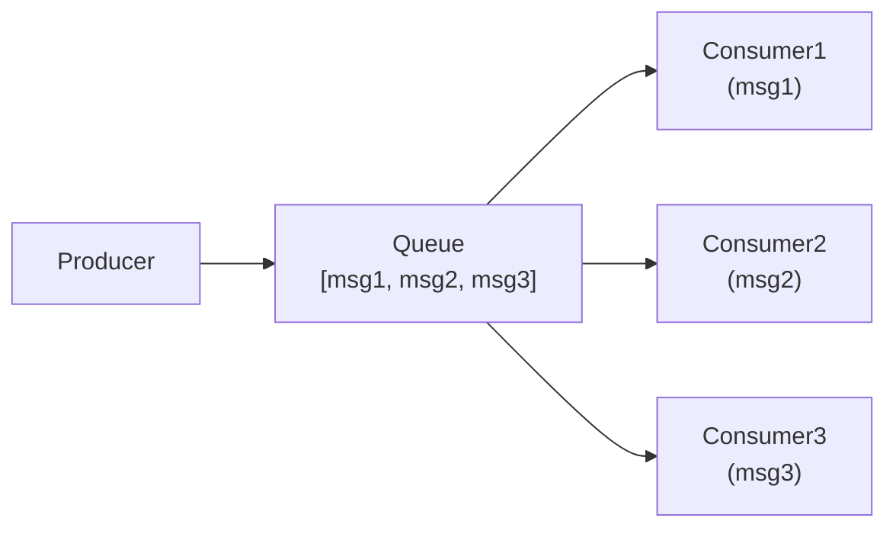
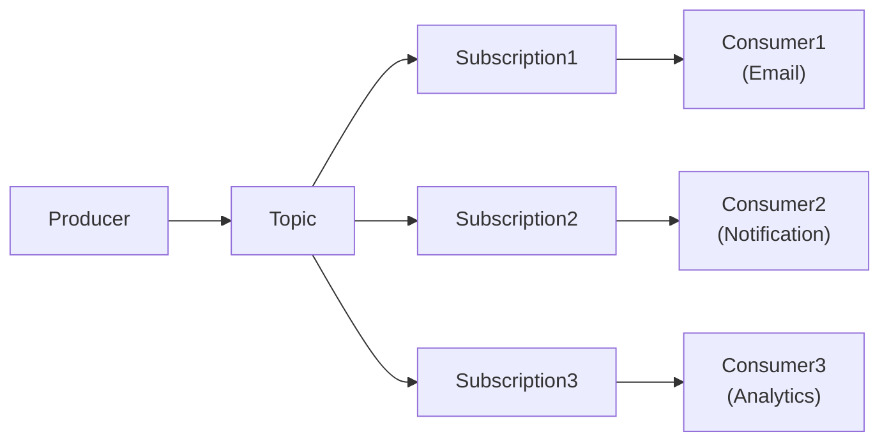
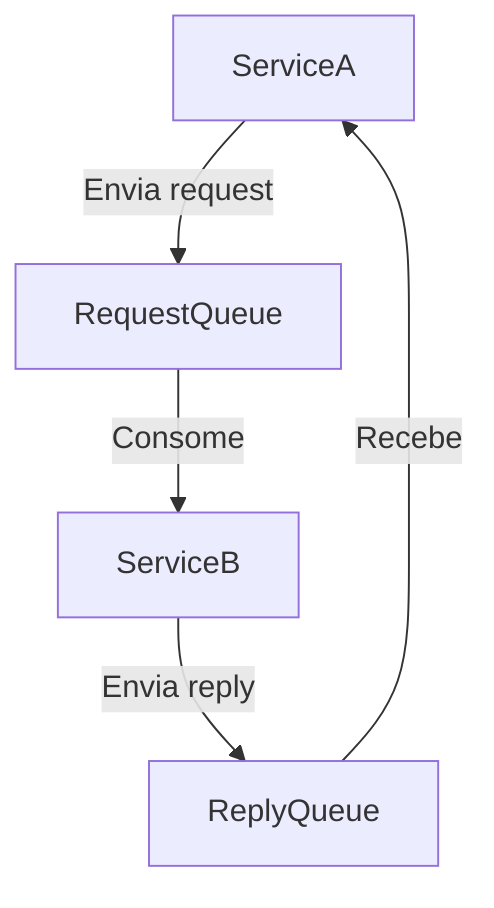

## Introdução

**Padrões de messaging** resolvem comunicação entre serviços sem acoplamento. Cada padrão tem trade-offs: latência, garantias de entrega, complexidade.

---

## Queue Pattern — Work Distribution

**Problema**: Distribuir trabalho entre múltiplos workers.



**Características**:

- FIFO (First-In-First-Out)
- 1 mensagem = 1 consumer (work stealing)
- At-least-once delivery
- Dead Letter Queue para falhas

**Use case**: Processamento de pedidos, jobs, tasks paralelos.

```csharp
// Enviar para fila
var message = new ServiceBusMessage(Encoding.UTF8.GetBytes(JsonSerializer.Serialize(order)));
await queueClient.SendMessageAsync(message);

// Consumir com prefetch
processor.PrefetchCount = 10;
processor.ProcessMessageAsync += async args =>
{
    var body = args.Message.Body.ToString();
    var order = JsonSerializer.Deserialize<Order>(body);
    await ProcessOrder(order);
    await args.CompleteMessageAsync(args.Message);
};

await processor.StartProcessingAsync();
```

---

## Topic/Pub-Sub Pattern — Broadcasting

**Problema**: Múltiplos consumidores precisam da mesma mensagem (event broadcasting).



**Características**:

- Event broadcasting
- Múltiplos subscribers independentes
- Cada subscription tem sua própria cópia
- Filtros de mensagem (opcional)

**Use case**: User signed up → enviar email + SMS + analytics.

```csharp
// Enviar evento para topic
var message = new ServiceBusMessage(JsonSerializer.SerializeToUtf8Bytes(userSignedUp));
await topicClient.SendMessageAsync(message);

// Subscriber 1: Email
var emailProcessor = topicClient.CreateProcessor("email-subscription");
emailProcessor.ProcessMessageAsync += async args =>
{
    var userSignedUp = JsonSerializer.Deserialize<UserSignedUp>(args.Message.Body);
    await _emailService.SendWelcomeAsync(userSignedUp.Email);
    await args.CompleteMessageAsync(args.Message);
};
await emailProcessor.StartProcessingAsync();

// Subscriber 2: SMS
var smsProcessor = topicClient.CreateProcessor("sms-subscription");
smsProcessor.ProcessMessageAsync += async args =>
{
    var userSignedUp = JsonSerializer.Deserialize<UserSignedUp>(args.Message.Body);
    await _smsService.SendAsync(userSignedUp.Phone);
    await args.CompleteMessageAsync(args.Message);
};
```

---

## Request-Reply Pattern — RPC Assíncrono

**Problema**: Serviço A precisa do resultado de Serviço B, mas sem blocking.



**Características**:

- Correlation ID identifica request/reply
- Timeout necessário
- Mais complexo que sync RPC

**Use case**: Pricing service, currency conversion, inventory check.

```csharp
// Request
var replyTo = new ReplyToGroupedProperties
{
    ReplyToSessionId = orderId.ToString()
};
var message = new ServiceBusMessage(JsonSerializer.SerializeToUtf8Bytes(pricingRequest))
{
    ReplyTo = "pricing-reply-queue",
    CorrelationId = orderId.ToString()
};
await requestClient.SendMessageAsync(message);

// Reply (async) — wait com timeout
var reply = await replyClient.ReceiveMessageAsync(TimeSpan.FromSeconds(5));
if (reply != null)
{
    var pricingResult = JsonSerializer.Deserialize<PricingResult>(reply.Body);
    // usar resultado
}
```

---

## Saga Pattern — Transações Distribuídas

**Problema**: Coordenar múltiplos serviços em uma "transação lógica".

```
Order Service
    ↓
Publish: OrderCreated
    ↓
Payment Service → Publish: PaymentProcessed ou PaymentFailed
    ↓
If PaymentProcessed:
  Inventory Service → Reserve stock
  Shipping Service → Create shipment

If PaymentFailed:
  Compensate: Refund, ReleaseInventory, CancelShipment
```

**Tipos**:

- **Choreography**: Serviços publicam eventos, próximo subscreve (descentralizado, difícil debugar)
- **Orchestration**: Orquestrador comanda passo a passo (explícito, escalável)

**Use case**: Checkout (Order → Payment → Inventory → Shipment → Notification).

```csharp
// Choreography: cada serviço publica eventos
public class OrderCreatedConsumer : IConsumer<OrderCreated>
{
    private readonly IPublishEndpoint _publish;

    public async Task Consume(ConsumeContext<OrderCreated> context)
    {
        var order = context.Message;

        try
        {
            // Tentar processar pagamento
            var paymentResult = await _paymentService.ProcessAsync(order.Total);

            // Se sucesso, publicar evento
            await _publish.Publish(new PaymentProcessed { OrderId = order.Id });
        }
        catch (Exception ex)
        {
            // Se falha, publicar compensação
            await _publish.Publish(new PaymentFailed { OrderId = order.Id, Reason = ex.Message });
        }
    }
}

// Orchestration: orquestrador controla fluxo
public class OrderSaga : Saga<OrderSagaState>,
    ISagaStateMachine<OrderSagaState>,
    IAmStartedBy<OrderCreated>,
    IAmStartedBy<PaymentCompleted>,
    IAmStartedBy<PaymentFailed>
{
    // Define states e transitions
    public State Pending { get; private set; }
    public State PaymentProcessing { get; private set; }
    public State Completed { get; private set; }
    public State Failed { get; private set; }

    // Define events
    public Event<OrderCreated> OrderCreatedEvent { get; private set; }
    public Event<PaymentCompleted> PaymentCompletedEvent { get; private set; }

    // Configure state machine
    protected override void ConfigureStateMachine(InMemoryStateMachineConfigurator<OrderSagaState> cfg)
    {
        cfg.InstanceState(x => x.CurrentState);

        cfg.Event("OrderCreated", x => x.CorrelateById(m => m.Message.OrderId));
        cfg.Event("PaymentCompleted", x => x.CorrelateById(m => m.Message.OrderId));

        cfg.Initially()
            .When(OrderCreatedEvent)
            .Then(x => ProcessPayment(x.Data, x.Message))
            .TransitionTo(PaymentProcessing);

        cfg.During(PaymentProcessing)
            .When(PaymentCompletedEvent)
            .Then(x => ReserveInventory(x.Data))
            .TransitionTo(Completed);
    }
}
```

---

## Dead Letter Queue (DLQ)

**Problema**: Mensagens que falharam precisam de armazenamento para análise.

```
Queue → Process → ✅ Success (delete)
                → ❌ Failure → Retry (requeue)
                              → Max retries → DLQ (dead letter queue)
```

```csharp
// Configurar DLQ
var queueOptions = new CreateQueueOptions("orders")
{
    DeadLetteringOnMessageExpiration = true,
    MaxDeliveryCount = 3,
    DefaultMessageTimeToLive = TimeSpan.FromHours(1)
};
await administrationClient.CreateQueueAsync(queueOptions);

// Consumer com retry + DLQ
try
{
    await ProcessMessage(message);
    await processor.CompleteMessageAsync(message);
}
catch (Exception ex)
{
    if (message.DeliveryCount >= 3)
    {
        // Move para DLQ automaticamente
        _logger.LogError($"Message {message.MessageId} moved to DLQ after {message.DeliveryCount} attempts");
        await processor.DeadLetterMessageAsync(message, "Max retries exceeded", ex.Message);
    }
    else
    {
        // Requeue para retry
        await processor.AbandonMessageAsync(message);
    }
}
```

---

## Armadilhas comuns

❌ **Queue vs Topic confundido** → Perca de eventos (queue) ou duplicação (topic)

❌ **Sem DLQ** → Mensagens ruins desaparecem, sem auditoria

❌ **Sem idempotência** → Duplicatas processadas (network retry)

❌ **Sem timeout** → Request-Reply pende eternamente

❌ **Sem correlation ID** → Impossível rastrear request/reply

❌ **Saga sem compensação** → Falha parcial deixa estado inconsistente

## Referências

- [Enterprise Integration Patterns](https://www.enterpriseintegrationpatterns.com/)
- [Azure Service Bus Messaging](https://docs.microsoft.com/en-us/azure/service-bus-messaging/)
- [MassTransit Saga](https://masstransit-project.com/advanced/sagas/)
- [Saga Pattern](https://microservices.io/patterns/data/saga.html)
