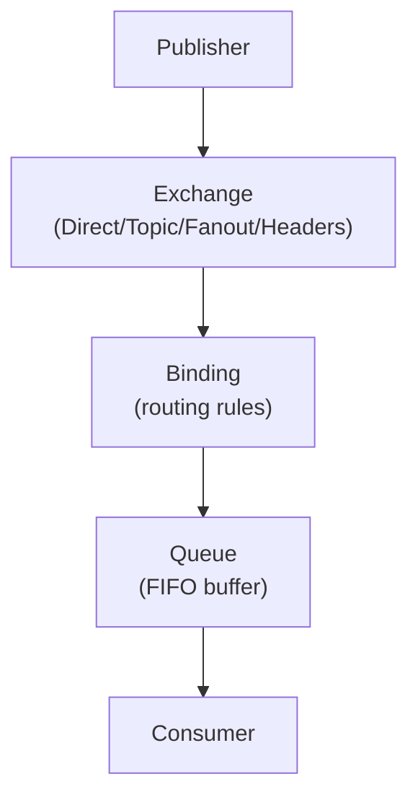
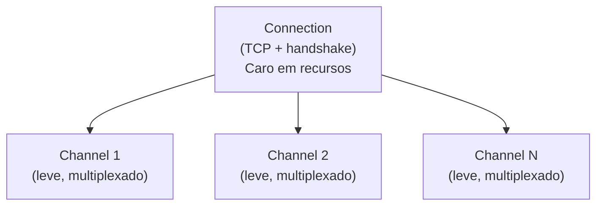

import { Tabs, TabItem } from "@astrojs/starlight/components";

## Introdução

**RabbitMQ** implementa AMQP 0-9-1. Mensagens não vão direto pra queue — passam por **Exchange** (router) que aplica regras via **Bindings**.

**Regra de ouro**: Connection é cara (TCP + handshake AMQP). Channel é leve (multiplexado). **Use 1 connection com múltiplos channels — 1 channel por thread.**

---

<Tabs>
  <TabItem label="🏗️ Arquitetura">

## Arquitetura AMQP



### Componentes-chave

| Componente      | Função                          |
| --------------- | ------------------------------- |
| **Exchange**    | Roteia mensagens (não armazena) |
| **Queue**       | Buffer FIFO persistido em disco |
| **Binding**     | Regra Exchange → Queue          |
| **Routing Key** | Chave de roteamento da mensagem |

### Virtual Hosts (vHosts)

```
Isolamento lógico por namespace
Cada vHost tem seu próprio set de Exchanges, Queues, Bindings
Padrão: /
Exemplo: /production, /staging
```

### Hierarquia AMQP



**Pattern**: 1 connection, múltiplos channels (1 por thread)

  </TabItem>

  <TabItem label="🔄 Exchanges">

## Exchange Types

### Direct Exchange — routing key exata

```csharp
// Declarar
channel.ExchangeDeclare("orders", ExchangeType.Direct, durable: true);

// Publicar
channel.BasicPublish("orders", routingKey: "order.created", body: body);

// Consumidor bind com chave exata
channel.QueueBind("order_queue", "orders", "order.created");
```

### Topic Exchange — pattern matching

```csharp
// Declarar
channel.ExchangeDeclare("events", ExchangeType.Topic, durable: true);

// Publicar com routing key
channel.BasicPublish("events", routingKey: "order.payment.completed", body: body);

// Consumer pode fazer bind com wildcards
// * = uma palavra | # = zero ou mais palavras
channel.QueueBind("queue1", "events", "order.payment.*");      // order.payment.completed
channel.QueueBind("queue2", "events", "order.#");              // order.*, order.payment.*
```

### Fanout Exchange — broadcast

```csharp
// Declarar
channel.ExchangeDeclare("notifications", ExchangeType.Fanout, durable: true);

// Publicar (routing_key ignorado)
channel.BasicPublish("notifications", routingKey: "", body: body);

// Todas as queues bindadas recebem
channel.QueueBind("email_queue", "notifications", "");
channel.QueueBind("sms_queue", "notifications", "");
channel.QueueBind("slack_queue", "notifications", "");
```

### Headers Exchange — roteamento por headers

```csharp
var headers = new Dictionary<string, object>
{
    { "region", "BR" },
    { "priority", "high" },
    { "x-match", "all" }  // "all" = todos devem casar, "any" = qualquer um
};

channel.ExchangeDeclare("header-exchange", ExchangeType.Headers, durable: true);
channel.QueueBind("queue-br-high", "header-exchange", "", arguments: headers);
```

| Tipo        | Roteamento                      | Uso                              |
| ----------- | ------------------------------- | -------------------------------- |
| **Direct**  | routing_key exato               | RPC, tarefas específicas         |
| **Topic**   | pattern matching (`*.order.*`)  | Múltiplos subscribers, filtragem |
| **Fanout**  | broadcast (ignora routing_key)  | Notificações, event streaming    |
| **Headers** | match headers (raramente usado) | Casos complexos                  |

  </TabItem>

  <TabItem label="📦 Queues">

## Queue Types

### Queue com Dead Letter Queue (DLQ)

```csharp
// Queue principal com DLQ configurada
var args = new Dictionary<string, object>
{
    { "x-dead-letter-exchange", "dlx" },     // Exchange DLX
    { "x-dead-letter-routing-key", "orders.dead" },
    { "x-message-ttl", 60000 }               // 60s TTL
};
channel.QueueDeclare("orders", durable: true, exclusive: false,
    autoDelete: false, arguments: args);

// Dead Letter Exchange + Queue
channel.ExchangeDeclare("dlx", ExchangeType.Direct, durable: true);
channel.QueueDeclare("orders.dead", durable: true,
    exclusive: false, autoDelete: false);
channel.QueueBind("orders.dead", "dlx", "orders.dead");
```

### Quorum Queue (recomendado produção)

```csharp
var quorumArgs = new Dictionary<string, object>
{
    { "x-queue-type", "quorum" },              // quorum = replicado em 3 nodes
    { "x-dead-letter-exchange", "dlx" },
    { "x-dead-letter-routing-key", "orders.dead" }
};
channel.QueueDeclare("orders-quorum", durable: true,
    exclusive: false, autoDelete: false, arguments: quorumArgs);
```

### Priority Queue

```csharp
var priorityArgs = new Dictionary<string, object>
{
    { "x-max-priority", 10 }  // 0-10, default 5
};
channel.QueueDeclare("priority-orders", durable: true,
    exclusive: false, autoDelete: false, arguments: priorityArgs);

// Ao publicar, definir prioridade
var props = channel.CreateBasicProperties();
props.Priority = 9;  // alta prioridade
channel.BasicPublish("", "priority-orders", props, body);
```

  </TabItem>

  <TabItem label="🔒 Reliability">

## Consumer com Manual Ack + Idempotência

```csharp
// Prefetch — flow control (N msgs sem ack antes de parar)
channel.BasicQos(prefetchSize: 0, prefetchCount: 10, global: false);

var consumer = new AsyncEventingBasicConsumer(channel);
consumer.Received += async (model, ea) =>
{
    try
    {
        var body = ea.Body.ToArray();
        var message = JsonSerializer.Deserialize<OrderCreated>(body);

        // Idempotência — verificar se já processou
        if (await _db.ProcessedMessages.AnyAsync(m => m.MessageId == ea.BasicProperties.MessageId))
        {
            channel.BasicAck(ea.DeliveryTag, multiple: false);
            return; // duplicata — ignora
        }

        // Processar
        await ProcessMessage(message!);

        // Registrar como processado + ack na mesma transação
        _db.ProcessedMessages.Add(new ProcessedMessage
        {
            MessageId = ea.BasicProperties.MessageId,
            ProcessedAt = DateTimeOffset.UtcNow
        });
        await _db.SaveChangesAsync();

        // ACK apenas após sucesso
        channel.BasicAck(ea.DeliveryTag, multiple: false);
    }
    catch (Exception ex)
    {
        _logger.LogError(ex, "Falha ao processar {Tag}", ea.DeliveryTag);
        // requeue: false → vai para DLQ se configurada, senão descarta
        channel.BasicNack(ea.DeliveryTag, multiple: false, requeue: false);
    }
};

channel.BasicConsume("orders", autoAck: false, consumer: consumer);
```

## Publisher Confirms

```csharp
channel.ConfirmSelect();  // Habilitar publisher confirms

var body = JsonSerializer.SerializeToUtf8Bytes(message);
var props = channel.CreateBasicProperties();
props.DeliveryMode = 2;  // Persistent
props.MessageId = Guid.NewGuid().ToString();

channel.BasicPublish("", "orders", props, body);

// Aguardar confirmação do broker (timeout em 5s)
if (!channel.WaitForConfirms(TimeSpan.FromSeconds(5)))
    throw new Exception("Broker não confirmou");
```

  </TabItem>

  <TabItem label="💻 .NET Client">

## ConnectionFactory com Recovery Automático

```csharp
var factory = new ConnectionFactory
{
    HostName = "localhost",
    Port = 5672,
    UserName = "guest",
    Password = "guest",
    VirtualHost = "/",

    // Recovery automático
    AutomaticRecoveryEnabled = true,
    NetworkRecoveryInterval = TimeSpan.FromSeconds(10),

    // Obrigatório para AsyncEventingBasicConsumer
    DispatchConsumersAsync = true
};

// ✅ 1 connection por aplicação (reutilize!)
using var connection = factory.CreateConnection();

// 1 channel por thread
using var channel = connection.CreateModel();
```

## Producer Completo

```csharp
public class RabbitMqPublisher : IDisposable
{
    private readonly IConnection _connection;
    private readonly IModel _channel;

    public RabbitMqPublisher(ConnectionFactory factory)
    {
        _connection = factory.CreateConnection();
        _channel = _connection.CreateModel();
        _channel.ConfirmSelect();
    }

    public void Publish<T>(string exchange, string routingKey, T message)
    {
        var body = JsonSerializer.SerializeToUtf8Bytes(message);

        var props = _channel.CreateBasicProperties();
        props.DeliveryMode = 2;  // persistent
        props.ContentType = "application/json";
        props.MessageId = Guid.NewGuid().ToString();
        props.Timestamp = new AmqpTimestamp(DateTimeOffset.UtcNow.ToUnixTimeSeconds());

        _channel.BasicPublish(exchange, routingKey, props, body);

        if (!_channel.WaitForConfirms(TimeSpan.FromSeconds(5)))
            throw new Exception("Broker não confirmou");
    }

    public void Dispose()
    {
        _channel?.Dispose();
        _connection?.Dispose();
    }
}
```

## Consumer Completo com BackgroundService

```csharp
public class OrderConsumerService : BackgroundService
{
    private readonly IConnection _connection;
    private readonly IModel _channel;
    private readonly IServiceScopeFactory _scopeFactory;
    private readonly ILogger _logger;

    public OrderConsumerService(
        ConnectionFactory factory,
        IServiceScopeFactory scopeFactory,
        ILogger<OrderConsumerService> logger)
    {
        _connection = factory.CreateConnection();
        _channel = _connection.CreateModel();
        _scopeFactory = scopeFactory;
        _logger = logger;

        _channel.BasicQos(0, prefetchCount: 10, global: false);
    }

    protected override Task ExecuteAsync(CancellationToken ct)
    {
        var consumer = new AsyncEventingBasicConsumer(_channel);
        consumer.Received += async (_, ea) =>
        {
            using var scope = _scopeFactory.CreateScope();
            var handler = scope.ServiceProvider
                .GetRequiredService<IOrderMessageHandler>();

            try
            {
                var body = ea.Body.ToArray();
                var order = JsonSerializer.Deserialize<OrderCreated>(body)!;

                await handler.HandleAsync(order, ct);

                _channel.BasicAck(ea.DeliveryTag, false);
            }
            catch (Exception ex)
            {
                _logger.LogError(ex, "Erro processando {Tag}", ea.DeliveryTag);
                _channel.BasicNack(ea.DeliveryTag, false, requeue: false);
            }
        };

        _channel.BasicConsume("orders", autoAck: false, consumer: consumer);
        return Task.CompletedTask;
    }

    public override void Dispose()
    {
        _channel?.Dispose();
        _connection?.Dispose();
        base.Dispose();
    }
}
```

## Health Check

```csharp
// NuGet: AspNetCore.HealthChecks.Rabbitmq

builder.Services.AddHealthChecks()
    .AddRabbitMQ(sp =>
    {
        var factory = sp.GetRequiredService<ConnectionFactory>();
        return factory.CreateConnection();
    },
    name: "rabbitmq",
    tags: new[] { "ready" });
```

  </TabItem>

  <TabItem label="📮 MassTransit">

## Setup com Retry e Circuit Breaker

```csharp
builder.Services.AddMassTransit(x =>
{
    // Registrar todos os consumers do assembly
    x.AddConsumers(typeof(Program).Assembly);

    x.UsingRabbitMq((context, cfg) =>
    {
        cfg.Host("localhost", "/", h =>
        {
            h.Username("guest");
            h.Password("guest");
        });

        // Retry global
        cfg.UseMessageRetry(r => r.Intervals(
            TimeSpan.FromSeconds(1),
            TimeSpan.FromSeconds(5),
            TimeSpan.FromSeconds(15)));

        // Circuit Breaker global
        cfg.UseCircuitBreaker(cb =>
        {
            cb.TrackingPeriod = TimeSpan.FromMinutes(1);
            cb.TripThreshold = 15;        // 15% de falhas
            cb.ActiveThreshold = 10;      // mínimo 10 msgs
            cb.ResetInterval = TimeSpan.FromMinutes(5);
        });

        cfg.ConfigureEndpoints(context);
    });
});
```

## Consumer Tipado

```csharp
public record OrderCreated(Guid OrderId, string CustomerId, decimal Total);

public class OrderCreatedConsumer : IConsumer<OrderCreated>
{
    private readonly IOrderService _orderService;
    private readonly ILogger<OrderCreatedConsumer> _logger;

    public OrderCreatedConsumer(IOrderService orderService, ILogger<OrderCreatedConsumer> logger)
    {
        _orderService = orderService;
        _logger = logger;
    }

    public async Task Consume(ConsumeContext<OrderCreated> context)
    {
        var msg = context.Message;
        _logger.LogInformation("Processando pedido {OrderId}", msg.OrderId);

        await _orderService.ProcessAsync(msg.OrderId, msg.CustomerId, msg.Total);

        // Publicar resposta (opcional)
        await context.Publish(new OrderProcessed(msg.OrderId));
    }
}

// Publicar de um controller
public class OrderController : ControllerBase
{
    private readonly IPublishEndpoint _publish;

    [HttpPost]
    public async Task<IActionResult> Create(CreateOrderRequest req)
    {
        var order = new Order { Id = Guid.NewGuid(), Total = req.Total };
        // ... salvar ...

        await _publish.Publish(new OrderCreated(order.Id, req.CustomerId, req.Total));
        return Ok();
    }
}
```

## Outbox Pattern (transactional publishing)

```csharp
// NuGet: MassTransit.EntityFrameworkCore

builder.Services.AddMassTransit(x =>
{
    x.AddEntityFrameworkOutbox<AppDbContext>(o =>
    {
        o.UseSqlServer();                                    // ou UsePostgres()
        o.UseBusOutbox();
        o.QueryDelay = TimeSpan.FromSeconds(1);
        o.DuplicateDetectionWindow = TimeSpan.FromMinutes(5);
    });

    x.AddConsumers(typeof(Program).Assembly);

    x.UsingRabbitMq((context, cfg) =>
    {
        cfg.Host("localhost", "/", h =>
        {
            h.Username("guest");
            h.Password("guest");
        });
        cfg.ConfigureEndpoints(context);
    });
});

// Consumer — publicações são atômicas com SaveChanges
public class OrderCreatedConsumer : IConsumer<OrderCreated>
{
    private readonly AppDbContext _db;

    public async Task Consume(ConsumeContext<OrderCreated> ctx)
    {
        _db.Invoices.Add(new Invoice { OrderId = ctx.Message.OrderId });
        await _db.SaveChangesAsync();  // outbox garante atomicidade

        // Publish só é enviado após SaveChanges
        await ctx.Publish(new InvoiceGenerated(ctx.Message.OrderId));
    }
}
```

  </TabItem>
</Tabs>

---

## ⚠️ Armadilhas comuns

| Armadilha                        | Problema                                                 | Solução                                                    |
| -------------------------------- | -------------------------------------------------------- | ---------------------------------------------------------- |
| **1 channel por publisher**      | ❌ Caro (TCP handshake), lento                           | ✅ Use pool de channels / 1 connection, múltiplos channels |
| **autoAck: true**                | ❌ Mensagem perdida se consumer falha                    | ✅ Use `autoAck: false` + manual ACK após processar        |
| **Sem durable**                  | ❌ Queue desaparece no reinício                          | ✅ `durable: true` em QueueDeclare                         |
| **Sem DLQ**                      | ❌ Mensagens ruins desaparecem silenciosamente           | ✅ Configure `x-dead-letter-exchange`                      |
| **Sem prefetch**                 | ❌ Consumer sobrecarregado (recebe tudo de uma vez)      | ✅ `channel.BasicQos(0, prefetchCount: 10)`                |
| **Sem idempotência**             | ❌ Duplicatas processadas múltiplas vezes                | ✅ Salve `idempotencyKey` no BD antes de processar         |
| **Lazy loading**                 | ❌ Channel criado quando precisa (lento na primeira vez) | ✅ Crie channels upfront no startup                        |
| **Connection não compartilhada** | ❌ Múltiplas connections = desperdício de recursos       | ✅ 1 connection por aplicação, reutilize                   |

## 📚 Referências

- [RabbitMQ Docs](https://www.rabbitmq.com/documentation.html)
- [AMQP 0-9-1 Spec](https://www.amqp.org/specification/0-9-1/amqp-org-download)
- [RabbitMQ.Client](https://github.com/rabbitmq/rabbitmq-dotnet-client)
- [MassTransit](https://masstransit-project.com/)
