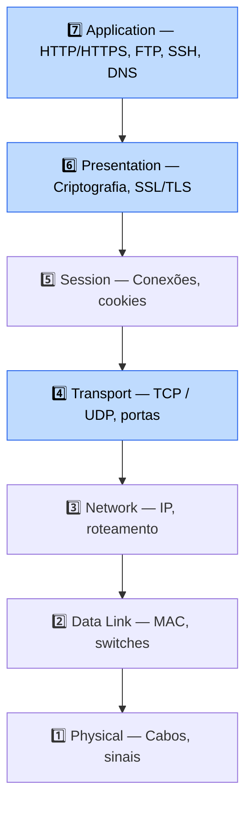
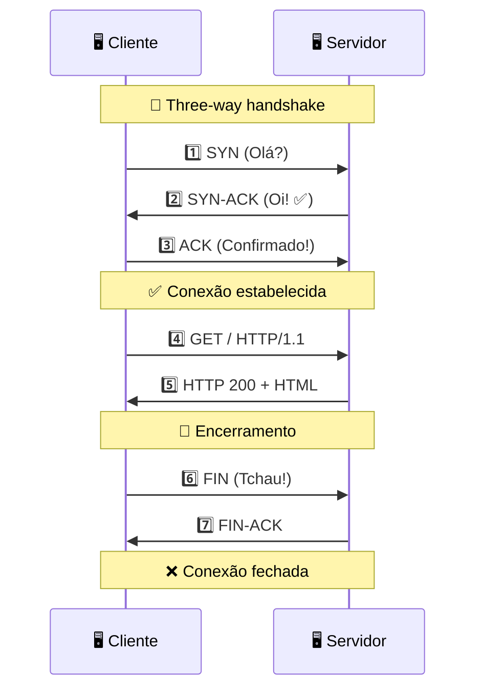
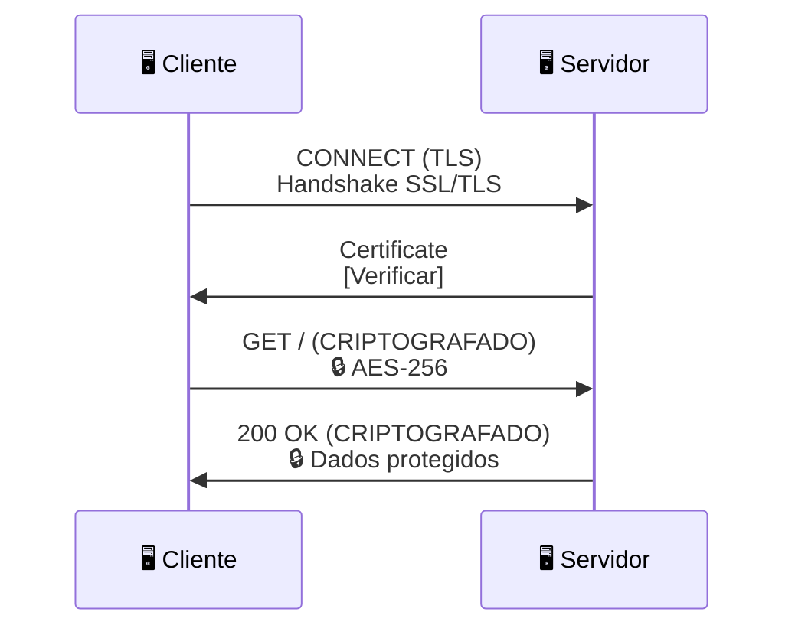
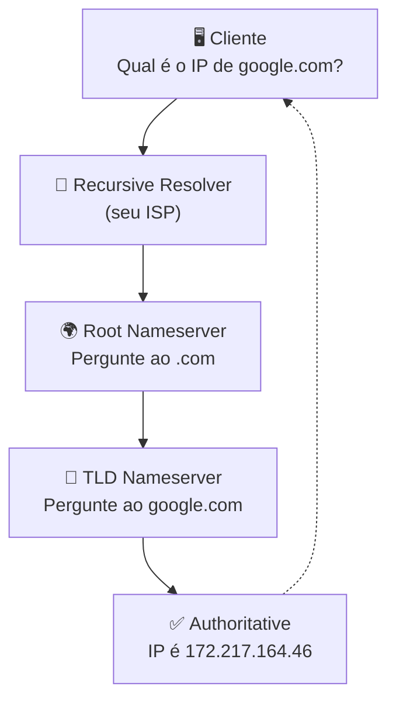
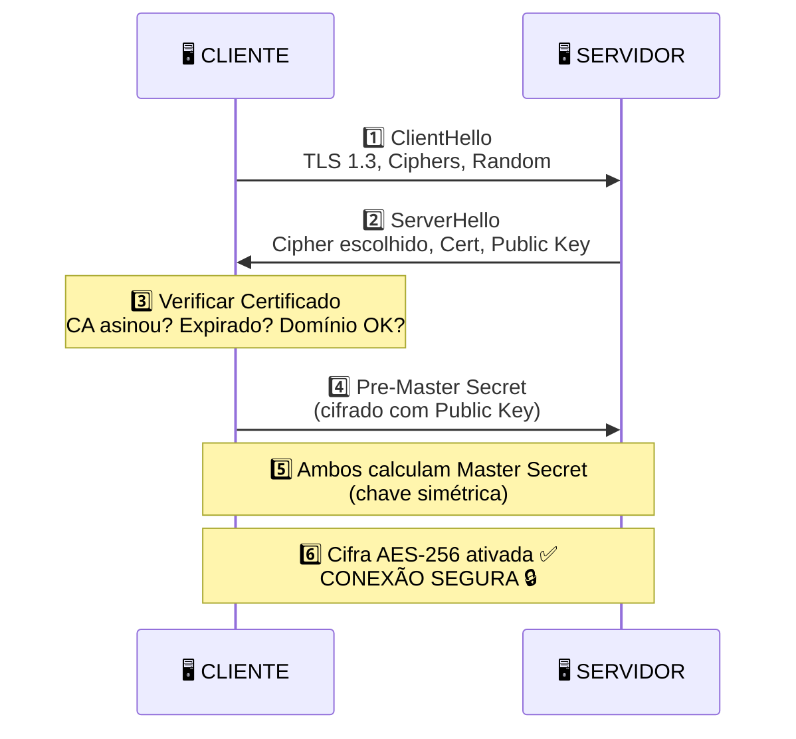
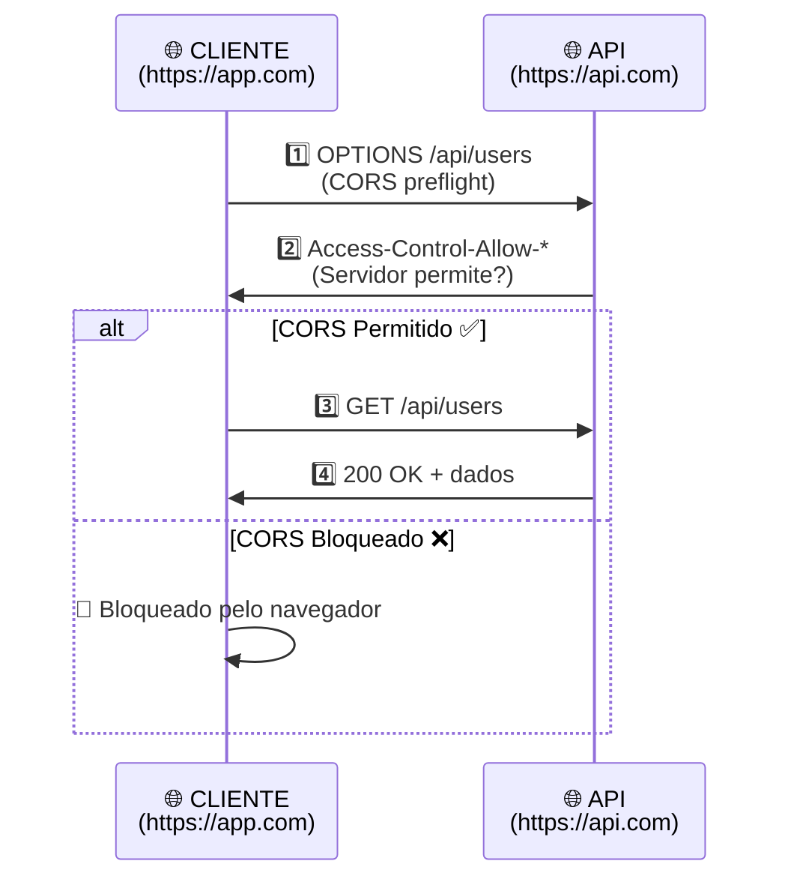

import { Tabs, TabItem } from "@astrojs/starlight/components";
import { Aside } from "@astrojs/starlight/components";

## Introdução

**Redes são a base da AppSec.** Se não entende como dados viajam pela internet, não consegue protegê-los. Este guia cobre o essencial para aplicações web seguras em .NET.

<Aside type="tip" title="Por que redes importam em AppSec?">
  90% dos ataques exploram falhas na comunicação de rede: man-in-the-middle, DNS spoofing, TLS mal
  configurado. Conhecer redes = detectar ataques.
</Aside>

---

## Modelo OSI — 7 Camadas



> 🔵 Em destaque: as camadas mais relevantes para **AppSec** (7, 6 e 4).

### Para AppSec, focamos em:

- **Camada 7 (Application):** HTTP/HTTPS, credenciais, tokens
- **Camada 6 (Presentation):** SSL/TLS, criptografia
- **Camada 4 (Transport):** TCP, portas abertas

---

## TCP/IP — Como funciona



> 📌 O _three-way handshake_ torna o TCP **confiável** (tudo chega). O UDP pula essa etapa: mais rápido, mas pode perder pacotes.

---

## Protocolos Essenciais

### HTTP/HTTPS

<Tabs>
<TabItem label="HTTP (❌ Inseguro)">

```mermaid
sequenceDiagram
    participant C as 🖥️ Cliente
    participant S as 🖥️ Servidor

    C->>S: GET / HTTP/1.1<br/>Host: example.com<br/>(TEXTO PURO!)
    S->>C: 200 OK<br/>&lt;html&gt;...<br/>(ANYONE CAN READ!)
```

🔓 **PROBLEMA**: Qualquer um no WiFi lê seus dados!

- Senhas, cookies, tokens → expostos

</TabItem>

<TabItem label="HTTPS (✅ Seguro)">



🔒 **SEGURANÇA**: Dados cifrados ponta-a-ponta

- Atacante vê: 🔒🔒🔒🔒🔒 (ilegível)

</TabItem>
</Tabs>

### DNS (Domain Name System)



🚨 **RISCO: DNS Spoofing**

- Atacante responde primeiro
- Você acessa fake-google.com do atacante
- Credenciais roubadas

**Proteção:** DNSSEC, DoH (DNS over HTTPS)

### SSH (Secure Shell)

```
🔐 SSH = Terminal remoto + criptografia

ssh -i private.key usuario@server.com
   │
   ├─ Autentica com chave (RSA 4096)
   ├─ Cifra conexão (AES-256)
   └─ Você tem acesso remoto seguro

✅ Melhor que Telnet (que é texto puro!)
```

### FTP vs SFTP

| Protocolo | Porta | Segurança  | Quando usar              |
| --------- | ----- | ---------- | ------------------------ |
| **FTP**   | 21    | ❌ NENHUMA | Nunca em produção!       |
| **SFTP**  | 22    | ✅ SSH     | Deploy automático, CI/CD |
| **FTPS**  | 990   | ✅ TLS     | Se obrigado a usar FTP   |

---

## Portas Comuns (Mapa de risco)

| 🟢 PORTA | PROTOCOLO  | SEGURANÇA   | QUANDO USAR               |
| -------- | ---------- | ----------- | ------------------------- |
| 80       | HTTP       | ❌ Inseguro | Redireciona para 443      |
| 443      | HTTPS      | ✅ Seguro   | Deve estar aberta         |
| 22       | SSH        | ✅ Seguro   | Apenas devs (firewall)    |
| 3306     | MySQL      | ❌ NUNCA    | Apenas interno (firewall) |
| 5432     | PostgreSQL | ❌ NUNCA    | Apenas interno (firewall) |

| 🔴 PORTA | PROTOCOLO | RISCO            | AÇÃO              |
| -------- | --------- | ---------------- | ----------------- |
| 23       | Telnet    | Texto puro       | ❌ Use SSH        |
| 21       | FTP       | Texto puro       | ❌ Use SFTP       |
| 25       | SMTP      | Sem auth         | ❌ Relay aberto   |
| 53       | DNS       | Amplificação     | ❌ Feche!         |
| 139      | NetBIOS   | Compartilhamento | ❌ Windows shares |
| 3389     | RDP       | Brute force      | ❌ Alvo favorito  |

**Em ASP.NET:**

```csharp
// Checar portas abertas (Burp Suite)
// Recomendação: apenas 80/443 liberadas externamente

app.UseHttpsRedirection(); // Força HTTPS
app.UseHsts(); // HTTP Strict Transport Security
```

---

## SSL/TLS — Handshake Detalhado



<Aside type="tip" title="TLS 1.3 vs 1.2">
  TLS 1.3 é mais rápido (1 round trip vs 2) e mais seguro. Desabilite TLS 1.0, 1.1, 1.2 em produção.
</Aside>

**Em ASP.NET:**

```csharp
services.AddHttpsRedirection(options =>
{
    options.HttpsPort = 443;
});

services.AddHsts(options =>
{
    options.MaxAge = TimeSpan.FromDays(365);
    options.IncludeSubDomains = true;
    options.Preload = true; // HSTS Preload List
});
```

---

## Certificados SSL/TLS

| Componente     | Valor                          |
| -------------- | ------------------------------ |
| **Subject**    | example.com                    |
| **Issuer**     | Let's Encrypt                  |
| **Válido**     | 2024-01-01 até 2025-01-01      |
| **Public Key** | -----BEGIN RSA PUBLIC KEY----- |
| **Signature**  | CA asinou digitalmente         |

✅ **Let's Encrypt**: Grátis, automático, recomendado  
✅ **DigiCert/GoDaddy**: Pago, suporte comercial  
❌ **Self-signed**: Navegador avisa "não confiável"

**Em ASP.NET (appsettings.json):**

```json
{
  "Kestrel": {
    "Endpoints": {
      "HttpsDefaultCert": {
        "Url": "https://localhost:7001",
        "Certificate": {
          "Path": "/etc/ssl/certs/certificate.pfx",
          "Password": "${CERT_PASSWORD}"
        }
      }
    }
  }
}
```

---

## CORS — Cross-Origin Resource Sharing



**Configurar em ASP.NET:**

```csharp
// ❌ Inseguro
services.AddCors(options =>
{
    options.AddPolicy("AllowAll", builder =>
    {
        builder.AllowAnyOrigin()
               .AllowAnyMethod()
               .AllowAnyHeader();
    });
});

// ✅ Seguro
services.AddCors(options =>
{
    options.AddPolicy("AllowSpecific", builder =>
    {
        builder.WithOrigins("https://app.com")
               .WithMethods("GET", "POST")
               .WithHeaders("Authorization", "Content-Type")
               .AllowCredentials();
    });
});
```

---

## Na prática: Auditando segurança de rede

### 1. Verificar certificado SSL

```bash
# Ver detalhes do certificado
openssl s_client -connect api.seuapp.com:443

# Verificar expiração
openssl x509 -noout -dates -in certificate.crt
```

### 2. Escanear portas (Burp Suite)

```
1. Burp > Network > Port Scanner
2. Inserir: seuapp.com
3. Ver quais portas estão abertas (risco!)
4. ❌ 3306 aberto = CRÍTICO
5. ✅ 80,443 abertos = OK (redirect HTTP)
```

### 3. Verificar headers de segurança

```bash
curl -I https://seuapp.com

# Deve ter:
# ✅ Strict-Transport-Security: max-age=31536000
# ✅ X-Content-Type-Options: nosniff
# ✅ X-Frame-Options: DENY
# ✅ Content-Security-Policy: default-src 'self'
```

### 4. Testar HTTPS redirect

```bash
curl -I http://seuapp.com

# Deve retornar:
# HTTP/1.1 301 Moved Permanently
# Location: https://seuapp.com/
```

---

## Checklist de segurança de rede

- [ ] ✅ HTTPS (TLS 1.3) em TODAS as URLs
- [ ] ✅ Certificado válido (não auto-assinado)
- [ ] ✅ Apenas portas 80/443 abertas externamente
- [ ] ✅ Banco de dados EM FIREWALL (porta 3306/5432 fechada)
- [ ] ✅ SSH com autenticação por chave (sem senha)
- [ ] ✅ HSTS + CORS configurados
- [ ] ✅ Sem protocols inseguros (FTP, Telnet, TLS 1.0/1.1)
- [ ] ✅ Security headers presentes (X-Frame, CSP, etc)

---

## Referências

- [RFC 7230 — HTTP/1.1](https://tools.ietf.org/html/rfc7230)
- [RFC 8446 — TLS 1.3](https://tools.ietf.org/html/rfc8446)
- [OWASP — Secure Communication](https://cheatsheetseries.owasp.org/cheatsheets/Secure_Communication_Cheat_Sheet.html)
- [ASP.NET Security Headers](https://learn.microsoft.com/en-us/aspnet/core/security/http-header-security)
- [Mozilla SSL Labs](https://www.ssllabs.com/ssltest/)
